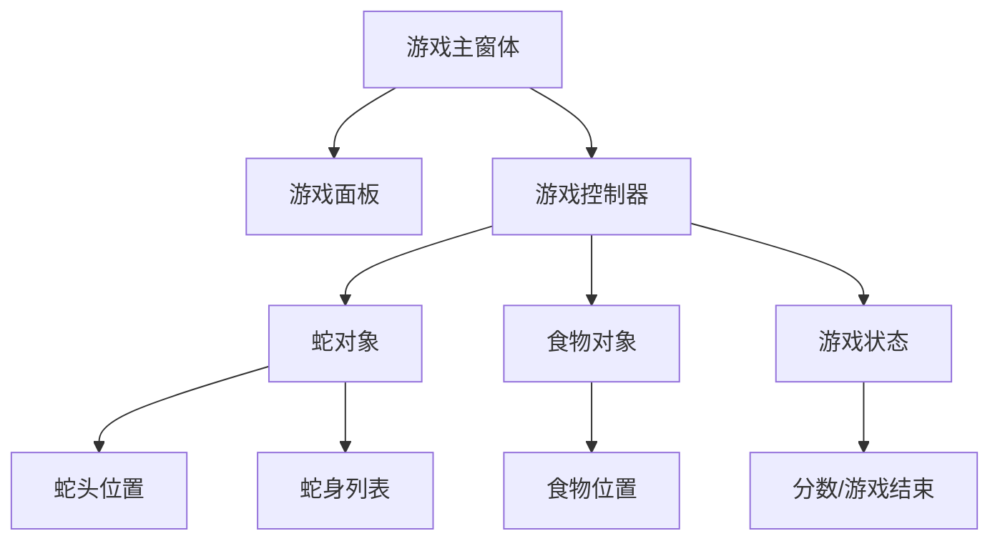

使用 C#和 Windows Forms 制作一个经典的贪吃蛇小游戏。

<!-- truncate -->

## 游戏架构设计

贪吃蛇游戏的核心组件包括：蛇身、食物、游戏面板和游戏逻辑控制。



## 核心数据结构

定义游戏中的基本数据结构：

```csharp
public class Point
{
    public int X { get; set; }
    public int Y { get; set; }

    public Point(int x, int y)
    {
        X = x;
        Y = y;
    }
}

public enum Direction
{
    Up, Down, Left, Right
}
```

## 游戏主逻辑

```csharp
public partial class SnakeGame : Form
{
    private List<Point> snake = new List<Point>();
    private Point food = new Point(0, 0);
    private Direction direction = Direction.Right;
    private int score = 0;
    private bool gameOver = false;
    private Timer gameTimer = new Timer();

    private const int GRID_SIZE = 20;
    private const int GAME_WIDTH = 600;
    private const int GAME_HEIGHT = 400;

    public SnakeGame()
    {
        InitializeComponent();
        InitializeGame();
    }

    private void InitializeGame()
    {
        // 设置窗体属性
        this.Size = new Size(GAME_WIDTH, GAME_HEIGHT);
        this.KeyPreview = true;

        // 初始化蛇
        snake.Add(new Point(100, 100));
        snake.Add(new Point(80, 100));
        snake.Add(new Point(60, 100));

        // 生成食物
        GenerateFood();

        // 设置定时器
        gameTimer.Interval = 150;
        gameTimer.Tick += GameLoop;
        gameTimer.Start();
    }

    private void GameLoop(object sender, EventArgs e)
    {
        if (gameOver) return;

        MoveSnake();
        CheckCollision();
        CheckFood();
        Invalidate(); // 重绘界面
    }

    private void MoveSnake()
    {
        Point head = snake[0];
        Point newHead = new Point(head.X, head.Y);

        // 根据方向移动蛇头
        switch (direction)
        {
            case Direction.Up: newHead.Y -= GRID_SIZE; break;
            case Direction.Down: newHead.Y += GRID_SIZE; break;
            case Direction.Left: newHead.X -= GRID_SIZE; break;
            case Direction.Right: newHead.X += GRID_SIZE; break;
        }

        snake.Insert(0, newHead);
        snake.RemoveAt(snake.Count - 1);
    }

    private void CheckCollision()
    {
        Point head = snake[0];

        // 检查墙壁碰撞
        if (head.X < 0 || head.X >= GAME_WIDTH ||
            head.Y < 0 || head.Y >= GAME_HEIGHT)
        {
            gameOver = true;
            return;
        }

        // 检查自身碰撞
        for (int i = 1; i < snake.Count; i++)
        {
            if (head.X == snake[i].X && head.Y == snake[i].Y)
            {
                gameOver = true;
                return;
            }
        }
    }

    private void CheckFood()
    {
        if (snake[0].X == food.X && snake[0].Y == food.Y)
        {
            score += 10;
            snake.Add(new Point(0, 0)); // 增加蛇身
            GenerateFood();
        }
    }

    private void GenerateFood()
    {
        Random random = new Random();
        food.X = random.Next(0, GAME_WIDTH / GRID_SIZE) * GRID_SIZE;
        food.Y = random.Next(0, GAME_HEIGHT / GRID_SIZE) * GRID_SIZE;
    }
}
```

## 游戏渲染

```csharp
protected override void OnPaint(PaintEventArgs e)
{
    base.OnPaint(e);

    if (gameOver)
    {
        DrawGameOver(e.Graphics);
        return;
    }

    // 绘制蛇
    for (int i = 0; i < snake.Count; i++)
    {
        Brush brush = i == 0 ? Brushes.Red : Brushes.Green;
        e.Graphics.FillRectangle(brush, snake[i].X, snake[i].Y,
                                GRID_SIZE, GRID_SIZE);
    }

    // 绘制食物
    e.Graphics.FillRectangle(Brushes.Blue, food.X, food.Y,
                           GRID_SIZE, GRID_SIZE);

    // 绘制分数
    e.Graphics.DrawString($"分数: {score}",
                         new Font("Arial", 12),
                         Brushes.Black, 10, 10);
}

private void DrawGameOver(Graphics g)
{
    string gameOverText = $"游戏结束！最终分数: {score}";
    Font font = new Font("Arial", 16);
    SizeF textSize = g.MeasureString(gameOverText, font);

    g.DrawString(gameOverText, font, Brushes.Red,
                (GAME_WIDTH - textSize.Width) / 2,
                (GAME_HEIGHT - textSize.Height) / 2);
}
```

## 键盘控制

```csharp
protected override void OnKeyDown(KeyEventArgs e)
{
    switch (e.KeyCode)
    {
        case Keys.Up:
            if (direction != Direction.Down) direction = Direction.Up;
            break;
        case Keys.Down:
            if (direction != Direction.Up) direction = Direction.Down;
            break;
        case Keys.Left:
            if (direction != Direction.Right) direction = Direction.Left;
            break;
        case Keys.Right:
            if (direction != Direction.Left) direction = Direction.Right;
            break;
        case Keys.Space:
            if (gameOver) RestartGame();
            break;
    }
}

private void RestartGame()
{
    snake.Clear();
    snake.Add(new Point(100, 100));
    snake.Add(new Point(80, 100));
    snake.Add(new Point(60, 100));

    direction = Direction.Right;
    score = 0;
    gameOver = false;
    GenerateFood();
}
```
