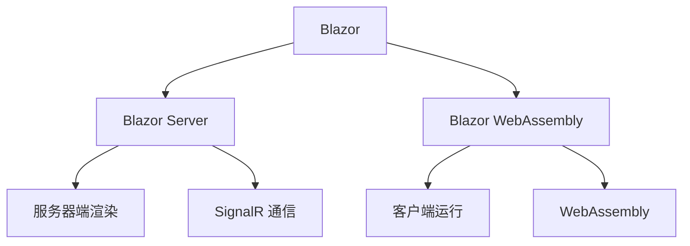
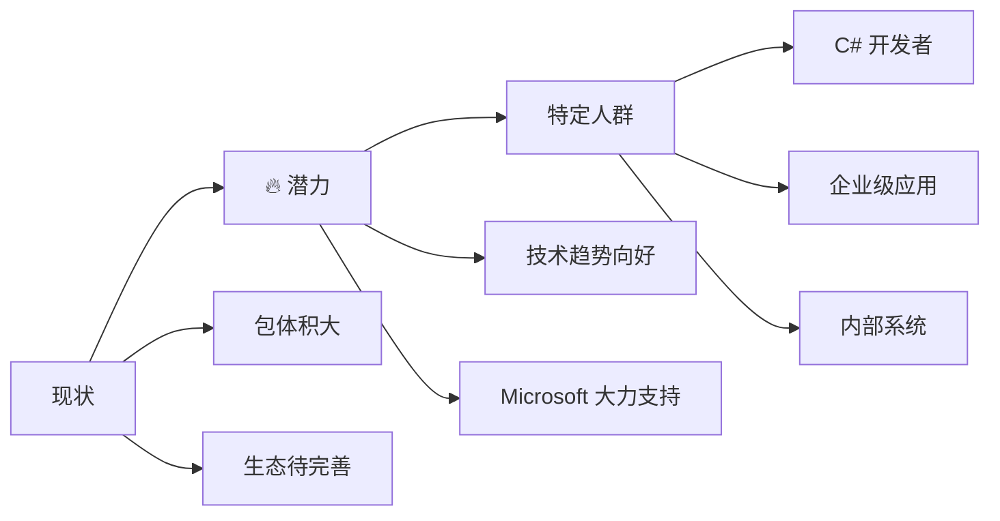

C# Blazor 和 Razor 是微软推出的现代 Web 开发技术，让 C# 开发者可以使用熟悉的语言构建交互式 Web 应用程序。

<!-- truncate -->

## 什么是 Razor

Razor 是微软开发的标记语法，它允许在 HTML 中嵌入 C# 代码。Razor 语法简洁直观，使用 `@` 符号来标识 C# 代码块。

```razor
@page "/hello"
@code {
    private string name = "World";
}

<h1>Hello @name!</h1>
<p>当前时间: @DateTime.Now</p>
```

## 什么是 Blazor

Blazor 是一个使用 C# 构建交互式 Web UI 的框架。它有两种主要的托管模式：



### Blazor Server

- 在服务器上运行 C# 代码
- 通过 SignalR 与客户端实时通信
- 启动快，包体积小

### Blazor WebAssembly

- 在浏览器中直接运行 C# 代码
- 通过 WebAssembly 技术实现
- 可以完全离线运行

## 核心概念

### 组件 (Components)

Blazor 应用由组件构成，每个组件都是一个 `.razor` 文件：

```razor
@* Counter.razor *@
<h3>计数器: @currentCount</h3>
<button @onclick="IncrementCount">点击 +1</button>

@code {
    private int currentCount = 0;

    private void IncrementCount()
    {
        currentCount++;
    }
}
```

### 数据绑定

Blazor 支持单向和双向数据绑定：

```razor
@* 单向绑定 *@
<p>输入的内容: @inputValue</p>

@* 双向绑定 *@
<input @bind="inputValue" />

@code {
    private string inputValue = "";
}
```

### 事件处理

处理用户交互事件：

```razor
<button @onclick="HandleClick">点击我</button>
<input @onchange="HandleChange" />

@code {
    private void HandleClick()
    {
        // 处理点击事件
    }

    private void HandleChange(ChangeEventArgs e)
    {
        // 处理输入变化
    }
}
```

## 开发优势

### 统一的开发体验

- 前后端使用同一种语言 (C#)
- 共享代码逻辑和模型
- 统一的开发工具和调试体验

### 丰富的生态系统

- 利用现有的 .NET 库和 NuGet 包
- 强大的 Visual Studio 支持
- 完整的测试框架

### 性能优化

- 编译时优化
- 增量渲染
- 组件级别的更新

## 总结



**适合人群：**

- 🎯 C# 技术栈团队 - 无需学习新语言，直接上手
- 🏢 企业级应用开发 - 管理后台、内部系统的理想选择
- 📊 数据密集型应用 - 复杂业务逻辑处理能力强

**总体评价：⭐⭐☆☆☆**

- **技术实力**：✅ 强大的 .NET 生态支持
- **发展前景**：✅ Microsoft 持续投入，WebAssembly 技术成熟
- **应用范围**：⚠️ 目前主要适用于特定场景，通用性有限
- **学习成本**：✅ C# 开发者友好，前后端统一

**一句话总结：潜力大于现状，适合特定人群 ，鉴定为 G**
