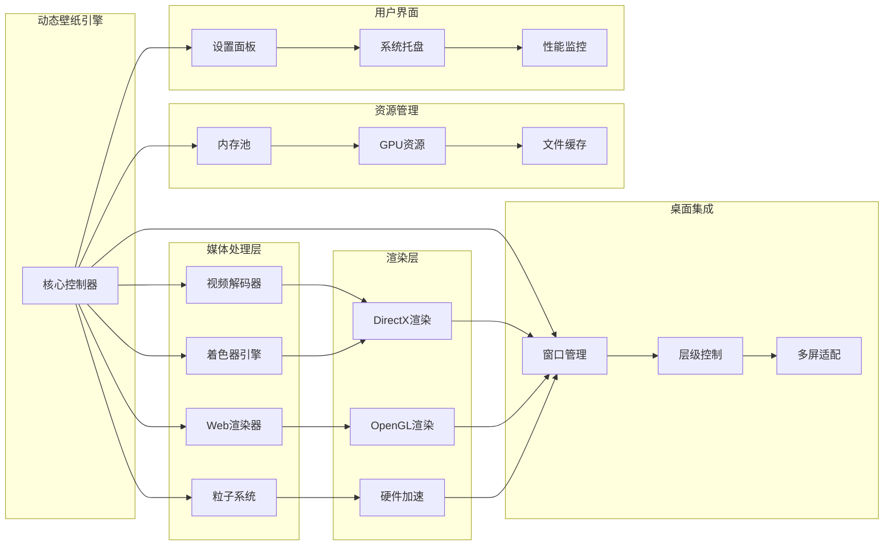

使用 C# 开发一个类似 Wallpaper Engine 的 Windows 动态壁纸软件，实现视频壁纸、Web 壁纸、粒子效果等动态内容的播放和管理。

<!-- truncate -->

## 核心架构设计

动态壁纸软件比传统静态壁纸复杂得多，需要处理多种媒体格式和渲染技术。整体架构设计如下：



## 桌面集成的核心实现

动态壁纸的关键在于如何将动态内容"贴"到桌面上，让它看起来像真正的壁纸。主要实现思路包括：

**1. 桌面窗口创建**
创建一个全屏窗口，插入到桌面图标层和桌面背景层之间。通过 Windows API 调用 `SetParent` 将窗口设置为桌面的子窗口，并调整窗口层级（Z-Order）。

```csharp
[DllImport("user32.dll")]
static extern IntPtr SetParent(IntPtr hWndChild, IntPtr hWndNewParent);

[DllImport("user32.dll")]
static extern IntPtr FindWindow(string lpClassName, string lpWindowName);

// 将窗口设置为桌面子窗口
private void SetAsDesktopChild(IntPtr windowHandle)
{
    IntPtr desktop = FindWindow("Progman", "Program Manager");
    SetParent(windowHandle, desktop);
}
```

**2. 窗口属性设置**

- 设置窗口为工具窗口，不在任务栏显示
- 禁用窗口交互，让鼠标事件穿透到桌面图标
- 设置窗口始终在桌面图标下方
- 处理窗口大小变化和多屏幕适配

**3. 性能优化**

- 当有全屏程序运行时自动暂停渲染
- 检测用户活动状态，空闲时降低帧率
- 使用硬件加速减少 CPU 占用

## 多媒体渲染技术

动态壁纸需要支持多种媒体格式，每种格式都有不同的渲染方式：

**视频壁纸渲染**
使用 MediaFoundation 或 FFmpeg 进行视频解码，将视频帧渲染到 DirectX 表面。需要处理视频循环播放、音频禁用、帧率控制等问题。对于高分辨率视频，可以使用硬件解码来提升性能。

```csharp
// 使用 MediaFoundation 播放视频
public class VideoWallpaperRenderer
{
    private MediaPlayer mediaPlayer;
    private D3D11Device device;

    public async Task LoadVideoAsync(string videoPath)
    {
        mediaPlayer = new MediaPlayer();
        mediaPlayer.Source = MediaSource.CreateFromUri(new Uri(videoPath));
        mediaPlayer.IsLoopingEnabled = true;
        mediaPlayer.IsMuted = true; // 禁用音频

        // 设置视频输出到 DirectX 表面
        mediaPlayer.SetSurfaceSize(new Size(screenWidth, screenHeight));
        await mediaPlayer.OpenAsync();
    }

    public void RenderFrame()
    {
        if (mediaPlayer.PlaybackSession.PlaybackState == MediaPlaybackState.Playing)
        {
            // 将视频帧渲染到 DirectX 纹理
            var texture = mediaPlayer.GetCurrentVideoFrame();
            device.ImmediateContext.CopyResource(texture, backBuffer);
        }
    }
}
```

**Web 内容渲染**
嵌入 WebView2 控件来显示 HTML5 内容，支持 JavaScript 动画、CSS 特效等。这种方式可以实现很多创意效果，如粒子动画、数据可视化等。需要注意的是要禁用 Web 内容的交互功能。

```csharp
public class WebWallpaperRenderer
{
    private WebView2 webView;

    public async Task InitializeAsync()
    {
        webView = new WebView2();
        await webView.EnsureCoreWebView2Async();

        // 禁用右键菜单和其他交互
        webView.CoreWebView2.Settings.AreDefaultContextMenusEnabled = false;
        webView.CoreWebView2.Settings.AreDevToolsEnabled = false;
        webView.CoreWebView2.Settings.AreHostObjectsAllowed = false;

        // 注入 CSS 禁用用户选择
        await webView.CoreWebView2.AddWebResourceRequestedFilterAsync("*", CoreWebView2WebResourceContext.Document);
        webView.CoreWebView2.WebResourceRequested += InjectCSS;
    }

    private void InjectCSS(object sender, CoreWebView2WebResourceRequestedEventArgs e)
    {
        string css = "body { user-select: none; pointer-events: none; }";
        // 注入 CSS 到页面
    }
}
```

**着色器效果渲染**
使用 DirectX 或 OpenGL 执行自定义着色器程序，实现复杂的视觉效果。可以支持用户自定义 HLSL 着色器，提供类似 Shadertoy 的效果。这部分需要良好的 GPU 编程基础。

## 资源管理与性能优化

动态壁纸软件是资源密集型应用，需要精心设计资源管理机制：

**内存管理策略**

- 实现纹理内存池，避免频繁的内存分配
- 使用 LRU 缓存策略管理视频帧
- 及时释放不再使用的 GPU 资源
- 监控内存使用情况，防止内存泄漏

```csharp
public class TexturePool
{
    private readonly Queue<Texture2D> availableTextures = new();
    private readonly Dictionary<IntPtr, Texture2D> usedTextures = new();
    private readonly int maxPoolSize = 10;

    public Texture2D GetTexture(int width, int height)
    {
        if (availableTextures.Count > 0)
        {
            var texture = availableTextures.Dequeue();
            usedTextures[texture.NativePointer] = texture;
            return texture;
        }

        // 创建新纹理
        var newTexture = new Texture2D(device, new Texture2DDescription
        {
            Width = width,
            Height = height,
            MipLevels = 1,
            ArraySize = 1,
            Format = Format.R8G8B8A8_UNorm,
            Usage = ResourceUsage.Default
        });

        usedTextures[newTexture.NativePointer] = newTexture;
        return newTexture;
    }

    public void ReturnTexture(Texture2D texture)
    {
        if (usedTextures.ContainsKey(texture.NativePointer))
        {
            usedTextures.Remove(texture.NativePointer);

            if (availableTextures.Count < maxPoolSize)
            {
                availableTextures.Enqueue(texture);
            }
            else
            {
                texture.Dispose();
            }
        }
    }
}
```

**GPU 资源优化**

- 使用适当的纹理格式和压缩
- 实现纹理流式加载，支持大尺寸内容
- 合理使用 GPU 缓存，避免重复上传数据
- 支持多 GPU 环境的负载均衡

**文件 IO 优化**

- 实现异步文件加载，避免界面卡顿
- 使用文件映射技术处理大文件
- 实现智能预加载机制
- 压缩存储壁纸资源包

## 用户体验设计

良好的用户体验是动态壁纸软件成功的关键：

**性能监控**
实时监控 CPU、GPU、内存使用情况，并在界面上显示。当系统资源不足时，自动降低渲染质量或暂停播放。提供性能配置选项，让用户根据硬件配置调整设置。

```csharp
public class PerformanceMonitor
{
    private PerformanceCounter cpuCounter;
    private PerformanceCounter memoryCounter;
    private Timer monitorTimer;

    public event Action<float, float, bool> PerformanceUpdated;

    public void StartMonitoring()
    {
        cpuCounter = new PerformanceCounter("Processor", "% Processor Time", "_Total");
        memoryCounter = new PerformanceCounter("Memory", "Available MBytes");

        monitorTimer = new Timer(UpdatePerformance, null, 0, 1000);
    }

    private void UpdatePerformance(object state)
    {
        float cpuUsage = cpuCounter.NextValue();
        float availableMemory = memoryCounter.NextValue();

        // 当 CPU 使用率超过 80% 或可用内存低于 1GB 时降低质量
        bool shouldReduceQuality = cpuUsage > 80 || availableMemory < 1024;

        PerformanceUpdated?.Invoke(cpuUsage, availableMemory, shouldReduceQuality);
    }
}
```

**交互控制**

- 支持壁纸暂停/播放控制
- 提供音量控制（某些壁纸可能包含音频）
- 支持自定义快捷键操作
- 实现壁纸收藏和分类管理

**兼容性处理**

- 检测显卡驱动版本，确保渲染兼容性
- 提供多种渲染后端选择（DirectX11/12、OpenGL）
- 支持不同 Windows 版本的桌面集成
- 处理高 DPI 显示器的缩放问题

## 扩展性架构

为了支持更多壁纸类型和功能扩展，需要设计灵活的插件架构：

**插件系统**
定义统一的插件接口，支持第三方开发者创建自定义壁纸类型。每种壁纸类型作为独立的插件加载，实现解耦和模块化。

```csharp
public interface IWallpaperPlugin
{
    string Name { get; }
    string Version { get; }
    string[] SupportedExtensions { get; }

    Task<bool> LoadAsync(string filePath);
    void Render(RenderContext context);
    void Update(float deltaTime);
    void Dispose();
}

public class PluginManager
{
    private readonly List<IWallpaperPlugin> plugins = new();

    public void LoadPlugins(string pluginDirectory)
    {
        var pluginFiles = Directory.GetFiles(pluginDirectory, "*.dll");

        foreach (var pluginFile in pluginFiles)
        {
            try
            {
                var assembly = Assembly.LoadFrom(pluginFile);
                var pluginTypes = assembly.GetTypes()
                    .Where(t => typeof(IWallpaperPlugin).IsAssignableFrom(t) && !t.IsInterface);

                foreach (var pluginType in pluginTypes)
                {
                    var plugin = (IWallpaperPlugin)Activator.CreateInstance(pluginType);
                    plugins.Add(plugin);
                }
            }
            catch (Exception ex)
            {
                Console.WriteLine($"Failed to load plugin {pluginFile}: {ex.Message}");
            }
        }
    }

    public IWallpaperPlugin GetPluginForFile(string filePath)
    {
        var extension = Path.GetExtension(filePath).ToLower();
        return plugins.FirstOrDefault(p => p.SupportedExtensions.Contains(extension));
    }
}
```

**脚本支持**
集成脚本引擎（如 Lua 或 JavaScript），允许用户创建交互式壁纸。脚本可以响应系统事件、时间变化、用户输入等，实现动态效果。

**社区功能**
实现壁纸分享和下载功能，建立壁纸社区。支持用户上传、评分、评论等功能，形成良好的生态系统。
