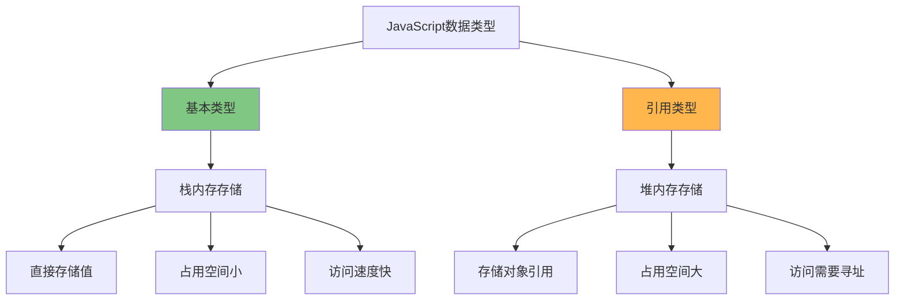
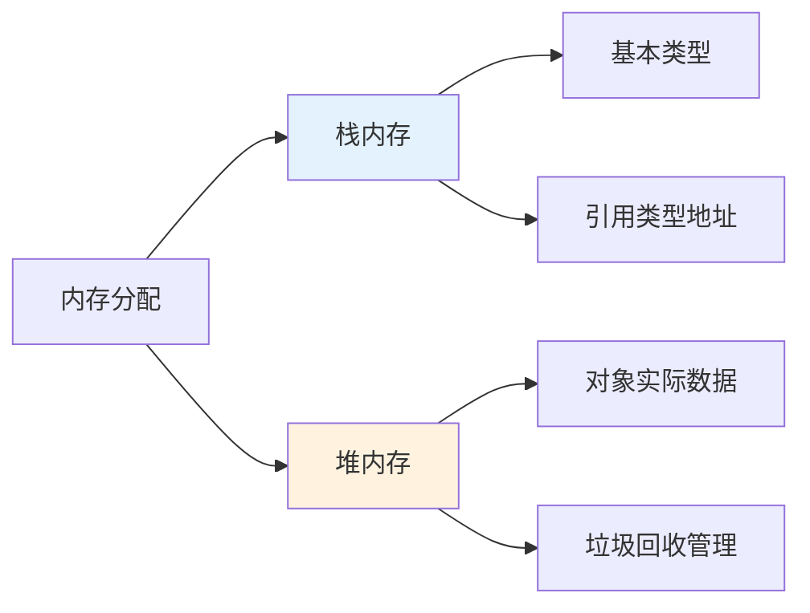

JavaScript 中的数据类型分为两大类：基本类型（Primitive Types）和引用类型（Reference Types）。

<!-- truncate -->

## 基本类型（Primitive Types）

JavaScript 有 7 种基本类型：

```javascript
// 7种基本类型
let num = 42; // number
let str = "hello"; // string
let bool = true; // boolean
let n = null; // null
let u = undefined; // undefined
let sym = Symbol("id"); // symbol
let big = 123n; // bigint
```

## 引用类型（Reference Types）

引用类型主要包括：

```javascript
// 引用类型
let obj = { name: "Alice" }; // Object
let arr = [1, 2, 3]; // Array
let func = function () {}; // Function
let date = new Date(); // Date
let regex = /pattern/; // RegExp
```

## 存储方式对比



## 核心区别

**赋值行为差异：**

```javascript
// 基本类型 - 值传递
let a = 10;
let b = a; // 复制值
a = 20;
console.log(a); // 20
console.log(b); // 10 (不受影响)

// 引用类型 - 引用传递
let obj1 = { count: 10 };
let obj2 = obj1; // 复制引用
obj1.count = 20;
console.log(obj1.count); // 20
console.log(obj2.count); // 20 (同时改变)
```

**函数参数传递：**

```javascript
// 基本类型参数
function changeValue(x) {
  x = 100;
}
let num = 50;
changeValue(num);
console.log(num); // 50 (原值不变)

// 引用类型参数
function changeObject(obj) {
  obj.name = "Bob";
}
let person = { name: "Alice" };
changeObject(person);
console.log(person.name); // "Bob" (原对象被修改)
```

**比较行为差异：**

```javascript
// 基本类型比较 - 比较值
let a = 5,
  b = 5;
console.log(a === b); // true

// 引用类型比较 - 比较引用地址
let obj1 = { name: "Alice" };
let obj2 = { name: "Alice" };
console.log(obj1 === obj2); // false (不同对象)

let obj3 = obj1;
console.log(obj1 === obj3); // true (引用相同对象)
```

## 内存管理



## 类型检测与深拷贝

**类型检测方法：**

```javascript
// 基本类型检测
console.log(typeof 42); // "number"
console.log(typeof "hello"); // "string"

// 引用类型检测
console.log(typeof {}); // "object"
console.log(Array.isArray([])); // true
console.log(Object.prototype.toString.call([])); // "[object Array]"
```

**深拷贝 vs 浅拷贝：**

```javascript
// 浅拷贝问题
let original = { name: "Alice", hobbies: ["reading", "coding"] };
let copy = { ...original }; // 浅拷贝
copy.hobbies.push("gaming");
console.log(original.hobbies); // ["reading", "coding", "gaming"]

// 深拷贝解决方案
let deepCopy = JSON.parse(JSON.stringify(original));

// 或使用递归函数
function deepClone(obj) {
  if (obj === null || typeof obj !== "object") return obj;
  if (obj instanceof Date) return new Date(obj);
  if (obj instanceof Array) return obj.map((item) => deepClone(item));

  let cloned = {};
  for (let key in obj) {
    if (obj.hasOwnProperty(key)) {
      cloned[key] = deepClone(obj[key]);
    }
  }
  return cloned;
}
```

## 关键区别总结

| 特性         | 基本类型 | 引用类型 |
| ------------ | -------- | -------- |
| **存储位置** | 栈内存   | 堆内存   |
| **存储内容** | 实际值   | 引用地址 |
| **赋值行为** | 值拷贝   | 引用拷贝 |
| **比较方式** | 值比较   | 引用比较 |
| **函数传参** | 值传递   | 引用传递 |
| **内存占用** | 固定且小 | 动态且大 |
| **访问速度** | 快       | 相对慢   |
