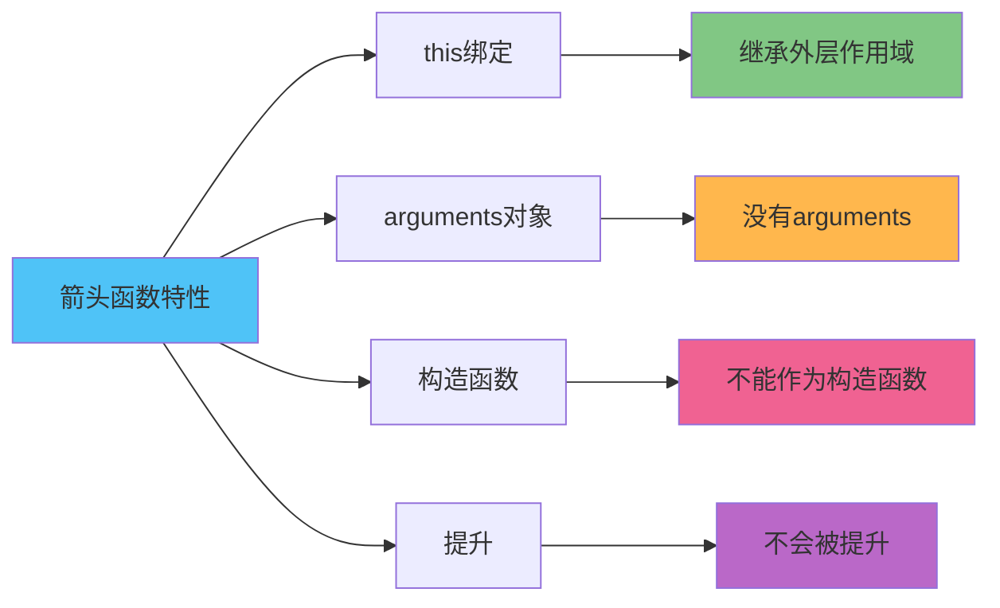

ES6 引入的箭头函数（Arrow Functions）是 JavaScript 中一种简洁的函数写法，它语法更加简洁，但与普通函数不太一样。

<!-- truncate -->

## 基本语法

箭头函数的语法比传统函数更加简洁：

```javascript
// 传统函数
function add(a, b) {
  return a + b;
}

// 箭头函数
const add = (a, b) => a + b;
```

## 语法变化对比

**传统函数组成部分：**

- `function` 关键字
- 函数名称
- 参数列表
- 函数体

**箭头函数组成部分：**

- 参数列表
- `=>` 箭头操作符
- 函数体

箭头函数省略了 `function` 关键字和函数名称，语法更加简洁。

## 不同参数情况的写法

### 无参数

```javascript
// 传统函数
function sayHello() {
  return "Hello!";
}

// 箭头函数
const sayHello = () => "Hello!";
```

### 单个参数

```javascript
// 传统函数
function square(x) {
  return x * x;
}

// 箭头函数（可省略括号）
const square = (x) => x * x;
```

### 多个参数

```javascript
// 传统函数
function multiply(a, b) {
  return a * b;
}

// 箭头函数
const multiply = (a, b) => a * b;
```

## 函数体的不同写法

### 单行表达式

```javascript
// 隐式返回
const double = (x) => x * 2;

// 等价于
const double = (x) => {
  return x * 2;
};
```

### 多行函数体

```javascript
const processData = (data) => {
  const filtered = data.filter((item) => item.active);
  const mapped = filtered.map((item) => item.name);
  return mapped;
};
```

### 返回对象字面量

```javascript
// ❌ 错误写法
const createUser = (name, age) => {
  name, age;
};

// ✅ 正确写法（需要用括号包裹）
const createUser = (name, age) => ({ name, age });
```

## 关键特性对比



## this 绑定差异

这是箭头函数最重要的特性：

```javascript
const obj = {
  name: "Alice",

  // 传统函数
  sayHello: function () {
    console.log(`Hello, ${this.name}`); // this指向obj
  },

  // 箭头函数
  sayHi: () => {
    console.log(`Hi, ${this.name}`); // this指向外层作用域
  },

  // 方法中使用箭头函数
  delayedGreeting: function () {
    setTimeout(() => {
      console.log(`Delayed hello, ${this.name}`); // this指向obj
    }, 1000);
  },
};

obj.sayHello(); // "Hello, Alice"
obj.sayHi(); // "Hi, undefined"
```

## 箭头函数与普通函数的区别对比

| 特性                | 普通函数         | 箭头函数         |
| ------------------- | ---------------- | ---------------- |
| **this 绑定**       | 运行时确定       | 定义时确定       |
| **arguments 对象**  | ✅ 有            | ❌ 没有          |
| **构造函数**        | ✅ 可以          | ❌ 不可以        |
| **函数提升**        | ✅ 有            | ❌ 没有          |
| **call/apply/bind** | ✅ 可以改变 this | ❌ 不能改变 this |
| **语法简洁性**      | 较复杂           | ✅ 简洁          |
