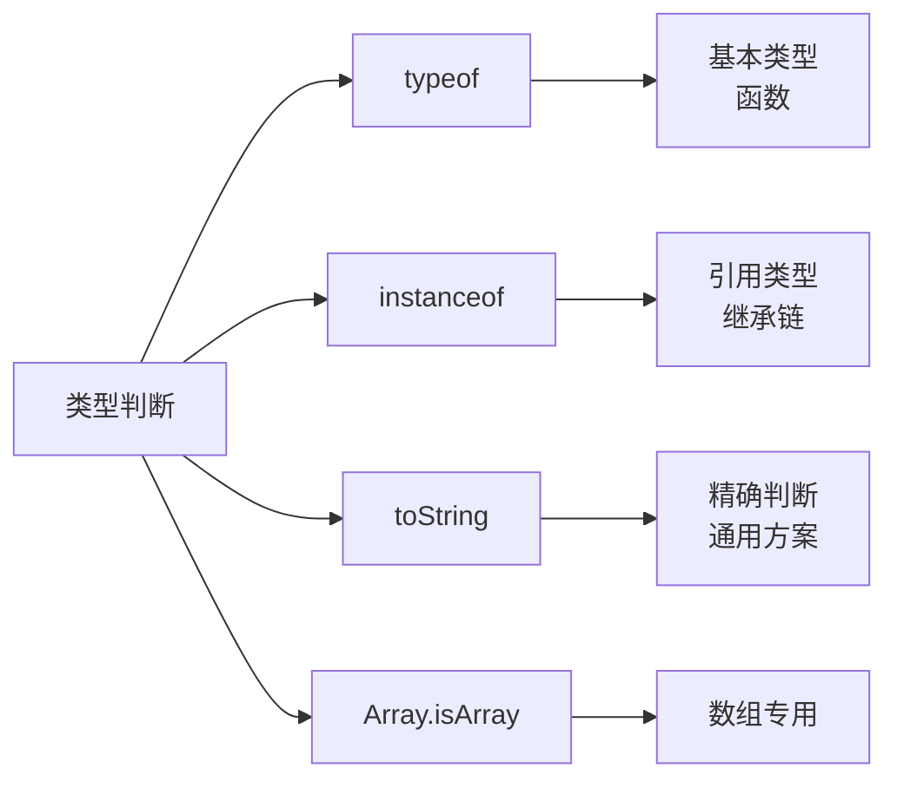

本文将介绍几种常用的类型判断方法，帮助你在不同场景下选择最合适的方式。

<!-- truncate -->

## 常用的类型判断方法

JavaScript 提供了多种方式来判断数据类型，每种方法都有其特点和适用场景。



## typeof 操作符

`typeof` 是最基础的类型判断方法，适用于基本类型和函数。

```javascript
// 基本类型
typeof 42; // "number"
typeof "hello"; // "string"
typeof true; // "boolean"
typeof undefined; // "undefined"
typeof null; // "object" (历史遗留问题)

// 引用类型
typeof {}; // "object"
typeof []; // "object"
typeof function () {}; // "function"
```

**注意**：`typeof null` 返回 `"object"`，这是 JavaScript 的历史遗留问题。

## instanceof 操作符

`instanceof` 用于检查对象是否是特定构造函数的实例，适用于引用类型判断。

```javascript
[] instanceof Array        // true
{} instanceof Object       // true
new Date() instanceof Date // true

// 检查继承关系
class Animal {}
class Dog extends Animal {}
const dog = new Dog()

dog instanceof Dog     // true
dog instanceof Animal  // true
```

## Object.prototype.toString

这是最准确的类型判断方法，可以精确识别所有数据类型。

```javascript
const getType = (obj) => Object.prototype.toString.call(obj).slice(8, -1);

getType(42); // "Number"
getType("hello"); // "String"
getType(true); // "Boolean"
getType(null); // "Null"
getType(undefined); // "Undefined"
getType({}); // "Object"
getType([]); // "Array"
getType(new Date()); // "Date"
getType(/regex/); // "RegExp"
```

## 实用的类型判断函数

基于以上方法，我们可以封装一个通用的类型判断工具：

```javascript
const typeChecker = {
  // 基本类型判断
  isNumber: (val) => typeof val === "number" && !isNaN(val),
  isString: (val) => typeof val === "string",
  isBoolean: (val) => typeof val === "boolean",
  isNull: (val) => val === null,
  isUndefined: (val) => val === undefined,

  // 引用类型判断
  isArray: Array.isArray,
  isObject: (val) =>
    val !== null && typeof val === "object" && !Array.isArray(val),
  isFunction: (val) => typeof val === "function",
  isDate: (val) => val instanceof Date,

  // 通用类型获取
  getType: (val) =>
    Object.prototype.toString.call(val).slice(8, -1).toLowerCase(),
};

// 使用示例
console.log(typeChecker.isArray([1, 2, 3])); // true
console.log(typeChecker.isObject({})); // true
console.log(typeChecker.getType(new Date())); // "date"
```

## 小结

- `typeof`：适用于基本类型和函数判断
- `instanceof`：适用于引用类型和继承关系检查
- `Object.prototype.toString`：最准确的类型判断方法
- `Array.isArray()`：数组判断的专用方法
