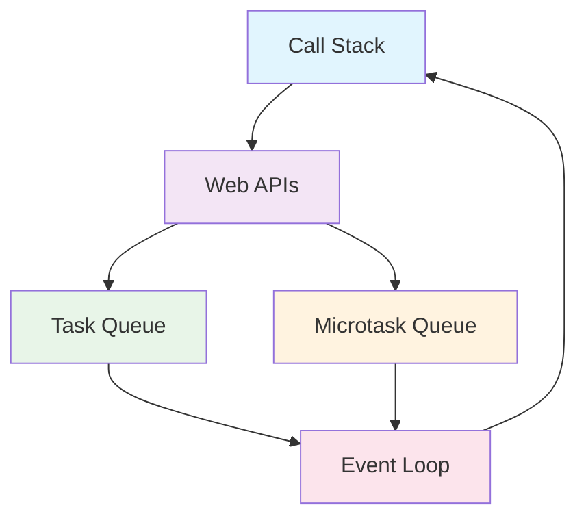
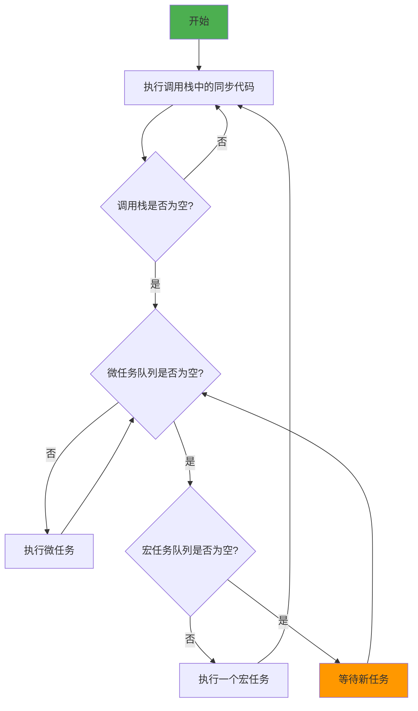
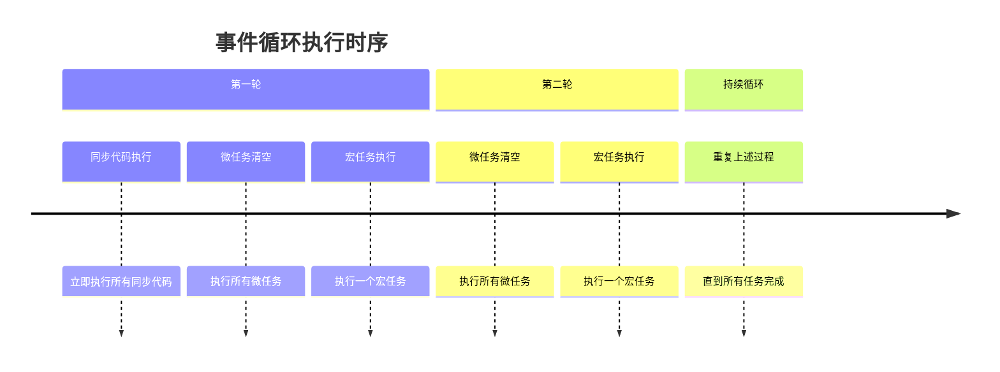
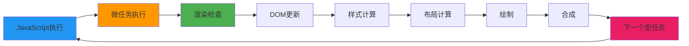

事件循环（Event Loop）是 JavaScript 运行时环境的核心机制，它决定了 JavaScript 代码的执行顺序。理解事件循环对于编写高质量的 JavaScript 代码至关重要。

<!-- truncate -->

## 什么是事件循环

事件循环是 JavaScript 引擎处理异步操作的机制。由于 JavaScript 是单线程语言，事件循环确保了代码的有序执行，同时不会阻塞用户界面。

## 浏览器中的执行环境

在浏览器中，JavaScript 的执行环境包含以下几个关键部分：

- **调用栈（Call Stack）**：存储函数调用的栈结构
- **Web APIs**：浏览器提供的异步 API（如 setTimeout、DOM 事件等）
- **任务队列（Task Queue）**：存储待执行的回调函数
- **微任务队列（Microtask Queue）**：存储 Promise 等微任务
- **事件循环（Event Loop）**：协调上述组件的工作

## 事件循环的工作流程

事件循环的工作流程可以简化为以下步骤：

1. **执行同步代码**：从调用栈中取出并执行函数
2. **检查微任务队列**：如果调用栈为空，优先处理微任务队列中的任务
3. **检查宏任务队列**：处理任务队列中的第一个任务
4. **重复循环**：继续上述过程

## 宏任务与微任务

### 宏任务（Macrotask）

宏任务是由宿主环境（浏览器）提供的异步操作：

- `setTimeout`
- `setInterval`
- `setImmediate`
- I/O 操作
- UI 渲染
- `postMessage`
- `MessageChannel`

### 微任务（Microtask）

微任务是由 JavaScript 引擎提供的异步操作：

- `Promise.then/catch/finally`
- `queueMicrotask`
- `MutationObserver`
- `process.nextTick`（Node.js）

## 执行优先级

事件循环的执行优先级如下：

1. **同步代码**：立即执行
2. **微任务**：在每个宏任务之后执行所有微任务
3. **宏任务**：按顺序执行，每次只执行一个

## 常见误区

### 误区 1：setTimeout(fn, 0) 会立即执行

`setTimeout(fn, 0)` 并不会立即执行，而是将回调函数添加到宏任务队列中，等待下一轮事件循环。

### 误区 2：Promise 总是异步的

Promise 的构造函数是同步执行的，只有 `.then/catch/finally` 才是异步的。

### 误区 3：微任务和宏任务的执行顺序

每次事件循环都会清空所有微任务，然后才执行一个宏任务。

## 浏览器渲染与事件循环

浏览器的渲染过程与事件循环密切相关：

1. 执行 JavaScript 代码
2. 执行微任务
3. 必要时进行渲染（重排、重绘）
4. 执行下一个宏任务

