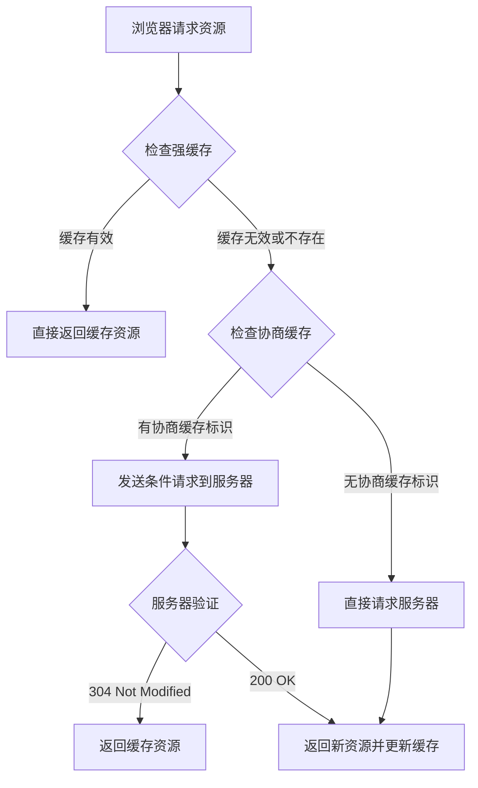
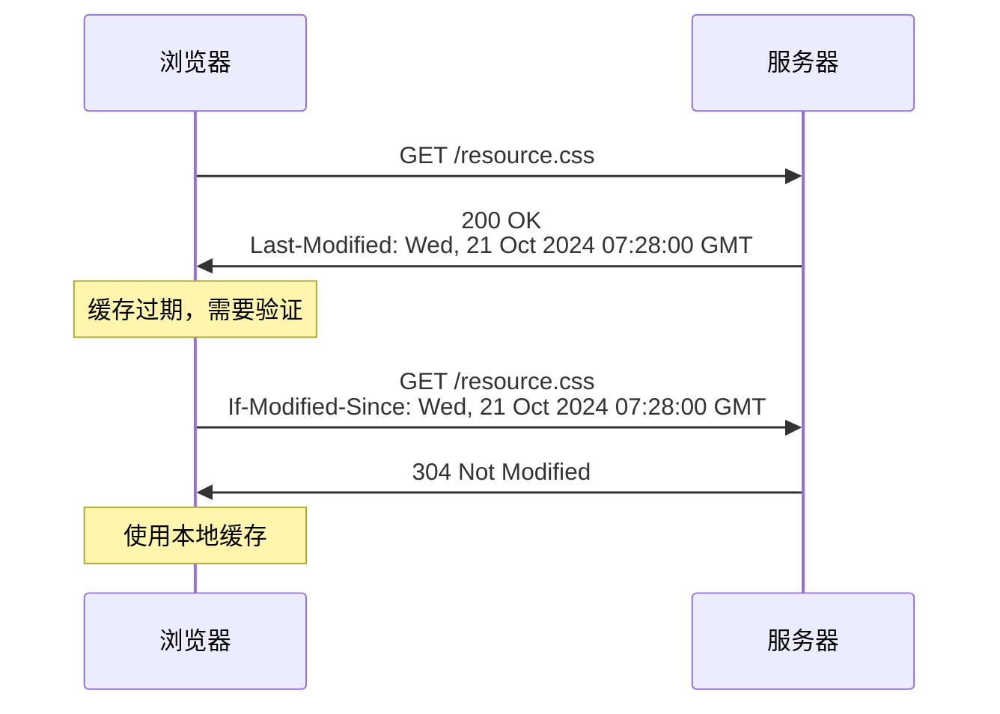

# HTTP 缓存

HTTP 缓存是 Web 性能优化的重要手段之一，合理使用缓存可以显著提升网站加载速度，减少服务器负载，改善用户体验。

<!-- truncate -->

## 什么是 HTTP 缓存？

HTTP 缓存是一种存储机制，它允许浏览器或中间代理服务器临时存储 Web 资源的副本，以便在后续请求中快速提供这些资源，而无需再次从源服务器获取。

### 缓存的好处

1. **减少延迟**：从本地缓存获取资源比从远程服务器获取更快
2. **减少带宽消耗**：避免重复下载相同资源
3. **降低服务器负载**：减少对源服务器的请求次数
4. **提升用户体验**：页面加载更快，响应更迅速

## HTTP 缓存的类型

HTTP 缓存可以分为两大类：**强缓存**和**协商缓存**。



### 强缓存

强缓存不需要向服务器发送请求，直接从缓存中读取资源。强缓存通过以下 HTTP 头部控制：

#### 1. Cache-Control

`Cache-Control` 是 HTTP/1.1 引入的缓存控制头，提供了更精细的缓存控制：

```http
Cache-Control: max-age=3600  # 缓存3600秒
Cache-Control: no-cache      # 必须验证缓存
Cache-Control: no-store      # 不缓存任何内容
Cache-Control: private       # 只能被浏览器缓存
Cache-Control: public        # 可以被任何缓存存储
```

**常用指令解释：**

- `max-age=秒数`：设置缓存的最大有效时间
- `no-cache`：可以缓存，但每次使用前必须向服务器验证
- `no-store`：不缓存任何内容
- `private`：只能被浏览器缓存，不能被共享缓存（如 CDN）缓存
- `public`：可以被任何缓存存储
- `must-revalidate`：缓存过期后必须向服务器验证

#### 2. Expires

`Expires` 是 HTTP/1.0 的缓存控制头，指定资源的过期时间：

```http
Expires: Wed, 21 Oct 2025 07:28:00 GMT
```

**注意：** 如果同时设置了 `Cache-Control: max-age` 和 `Expires`，`Cache-Control` 的优先级更高。

### 协商缓存

当强缓存失效时，浏览器会发送条件请求到服务器，询问资源是否有更新。协商缓存通过以下机制实现：

#### 1. Last-Modified / If-Modified-Since



#### 2. ETag / If-None-Match

```http
# 第一次请求
Response Headers:
ETag: "abc123"

# 后续请求
Request Headers:
If-None-Match: "abc123"
```

**ETag 的优势：**

- 精确性更高，能检测到任何内容变化
- 不受时间同步问题影响
- 支持弱验证和强验证

```javascript
// 弱ETag示例
ETag: W / "abc123";

// 强ETag示例
ETag: "abc123";
```
