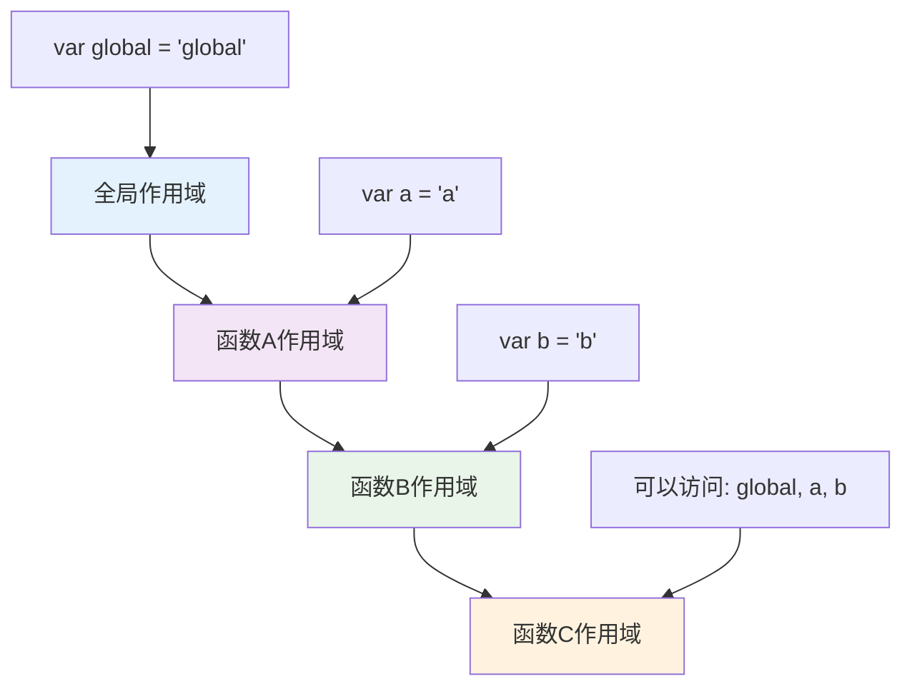
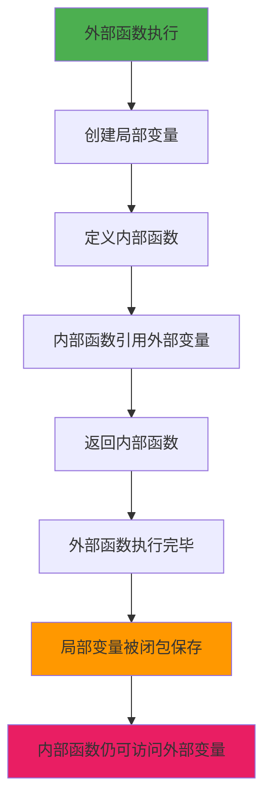
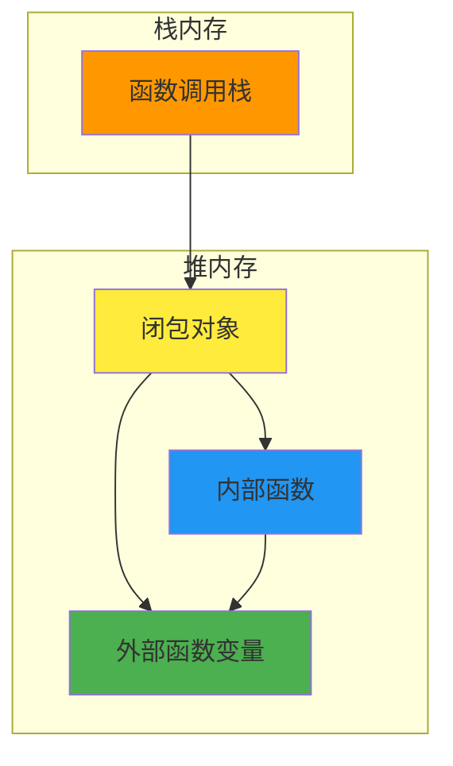
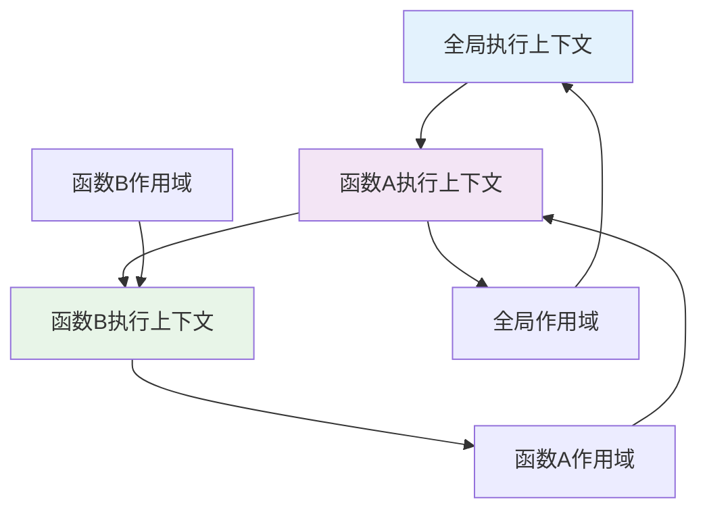

闭包（Closure）是 JavaScript 中一个概念，它让函数能够"记住"并访问其词法作用域，即使在函数外部执行时也是如此。

<!-- truncate -->

## 什么是闭包

闭包是指一个函数和其周围状态（词法环境）的引用捆绑在一起的组合。换句话说，闭包让你可以在一个内层函数中访问到其外层函数的作用域。

在 JavaScript 中，每当创建一个函数，闭包就会在函数创建的同时被创建出来。

## 词法作用域

在理解闭包之前，我们需要先了解词法作用域（Lexical Scoping）的概念。

词法作用域是指变量的作用域是在代码编写时就确定的，而不是在运行时确定的。JavaScript 采用的就是词法作用域。



## 闭包的形成

闭包的形成需要满足以下条件：

1. **函数嵌套**：内部函数嵌套在外部函数中
2. **引用外部变量**：内部函数引用了外部函数的变量
3. **返回内部函数**：外部函数返回内部函数



## 闭包的特性

### 1. 数据封装

闭包可以创建私有变量，实现数据的封装和隐藏：

```javascript
function createCounter() {
  let count = 0; // 私有变量

  return {
    increment: function () {
      count++;
      return count;
    },
    decrement: function () {
      count--;
      return count;
    },
    getCount: function () {
      return count;
    },
  };
}

const counter = createCounter();
console.log(counter.increment()); // 1
console.log(counter.getCount()); // 1
// count 变量无法直接访问
```

### 2. 状态保持

闭包可以让函数"记住"其创建时的环境：

```javascript
function multiplier(factor) {
  return function (number) {
    return number * factor;
  };
}

const double = multiplier(2);
const triple = multiplier(3);

console.log(double(5)); // 10
console.log(triple(5)); // 15
```

## 闭包的内存结构



当外部函数执行完毕后，如果内部函数仍然被引用，JavaScript 引擎会将外部函数的变量保存在堆内存中，形成闭包。

## 闭包的应用场景

### 1. 模块化

```javascript
const Module = (function () {
  let privateVar = "private";

  return {
    publicMethod: function () {
      return privateVar;
    },
  };
})();
```

### 2. 函数柯里化

```javascript
function curry(fn) {
  return function curried(...args) {
    if (args.length >= fn.length) {
      return fn.apply(this, args);
    } else {
      return function (...nextArgs) {
        return curried.apply(this, args.concat(nextArgs));
      };
    }
  };
}
```

### 3. 回调函数

```javascript
function setupButton(name) {
  return function () {
    console.log(`Button ${name} clicked!`);
  };
}

button.addEventListener("click", setupButton("submit"));
```

## 闭包的注意事项

### 1. 内存泄漏

闭包会阻止垃圾回收器回收外部函数的变量，如果不当使用可能导致内存泄漏：


### 2. 循环中的闭包

在循环中创建闭包时需要特别注意变量的作用域：

```javascript
// 问题代码
for (var i = 0; i < 3; i++) {
  setTimeout(function () {
    console.log(i); // 输出 3, 3, 3
  }, 100);
}

// 解决方案1：使用 let
for (let i = 0; i < 3; i++) {
  setTimeout(function () {
    console.log(i); // 输出 0, 1, 2
  }, 100);
}

// 解决方案2：使用 IIFE（立即执行函数表达式）
for (var i = 0; i < 3; i++) {
  (function (i) {
    setTimeout(function () {
      console.log(i); // 输出 0, 1, 2
    }, 100);
  })(i);
}

// 解决方案3：利用 setTimeout 的参数传递
for (var i = 0; i < 3; i++) {
  setTimeout(
    function (j) {
      console.log(j); // 输出 0, 1, 2
    },
    100,
    i
  );
}
```

## 闭包与作用域链



闭包实际上是作用域链的一个特殊应用，内部函数通过作用域链访问外部函数的变量。
