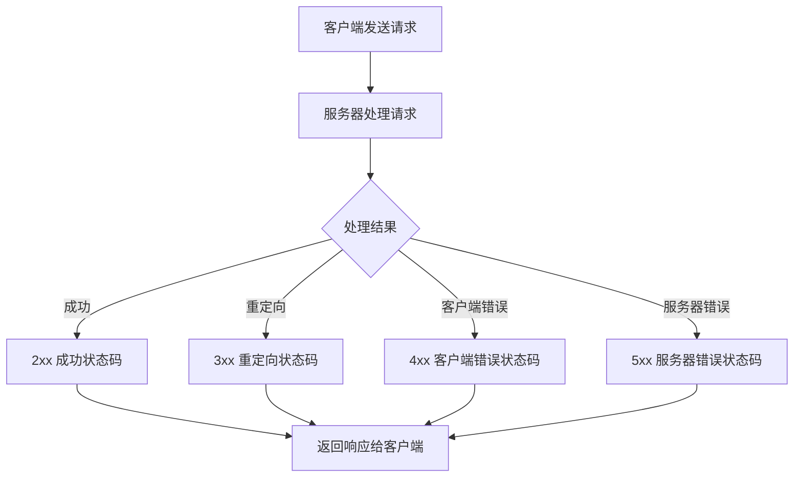
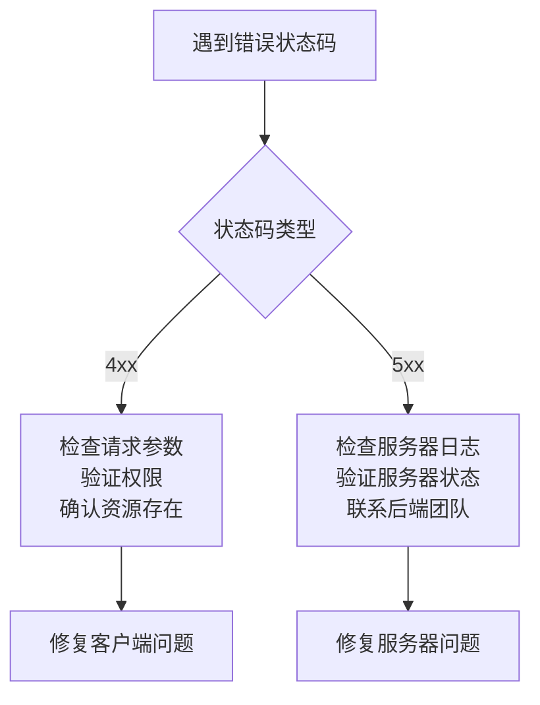

# HTTP 状态码完全指南

HTTP 状态码是服务器对客户端请求的标准化响应代码，它们告诉我们请求是否成功，以及如果失败的话是什么原因。

<!-- truncate -->

## 什么是 HTTP 状态码？

HTTP 状态码是由三位数字组成的代码，用于表示 HTTP 请求的处理结果。每个状态码都有特定的含义，帮助客户端理解服务器的响应状态。

## HTTP 状态码分类

HTTP 状态码按照第一位数字分为五大类：

### 1xx - 信息性状态码

这类状态码表示请求已被接收，正在处理中。

- **100 Continue**：服务器已接收请求头，客户端可以继续发送请求体
- **101 Switching Protocols**：服务器同意切换协议（如从 HTTP 升级到 WebSocket）

### 2xx - 成功状态码

表示请求已成功被服务器接收、理解和处理。

- **200 OK**：请求成功，这是最常见的成功状态码
- **201 Created**：请求成功并创建了新资源（常用于 POST 请求）
- **204 No Content**：请求成功，但没有返回内容（常用于 DELETE 请求）
- **206 Partial Content**：部分内容响应（用于断点续传）

### 3xx - 重定向状态码

表示需要客户端采取进一步的操作才能完成请求。

- **301 Moved Permanently**：永久重定向，搜索引擎会更新链接
- **302 Found**：临时重定向，原链接仍然有效
- **304 Not Modified**：资源未修改，可以使用缓存版本
- **307 Temporary Redirect**：临时重定向，必须保持原有的请求方法

### 4xx - 客户端错误状态码

表示客户端的请求有错误。

- **400 Bad Request**：请求语法错误或参数无效
- **401 Unauthorized**：未授权，需要身份验证
- **403 Forbidden**：服务器拒绝执行此请求
- **404 Not Found**：请求的资源不存在
- **405 Method Not Allowed**：请求方法不被允许
- **409 Conflict**：请求冲突，如尝试创建已存在的资源
- **429 Too Many Requests**：请求过于频繁，触发限流

### 5xx - 服务器错误状态码

表示服务器在处理请求时发生错误。

- **500 Internal Server Error**：服务器内部错误
- **502 Bad Gateway**：网关或代理服务器错误
- **503 Service Unavailable**：服务暂时不可用
- **504 Gateway Timeout**：网关超时

### 常见问题排查

_参考资料：_

- [HTTP 状态码标准 - RFC 7231](https://tools.ietf.org/html/rfc7231)
- [MDN HTTP 状态码文档](https://developer.mozilla.org/en-US/docs/Web/HTTP/Status)
