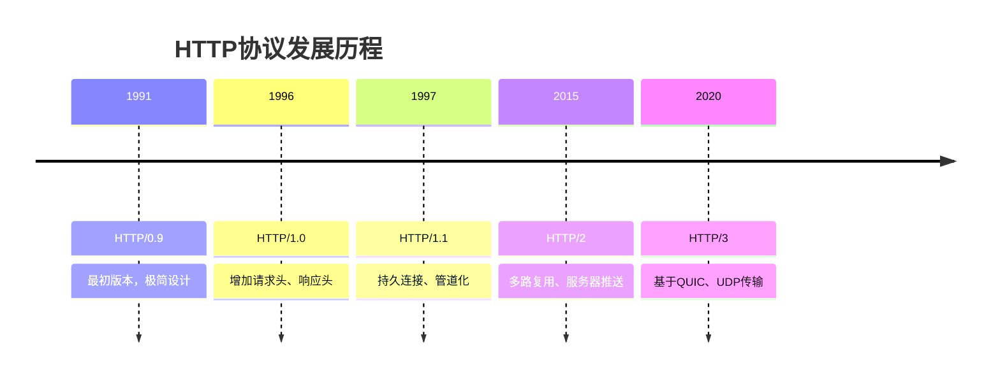
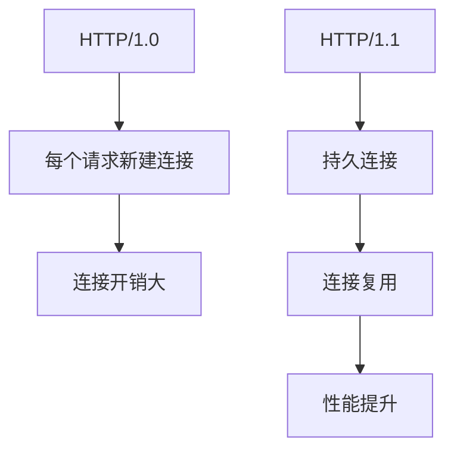
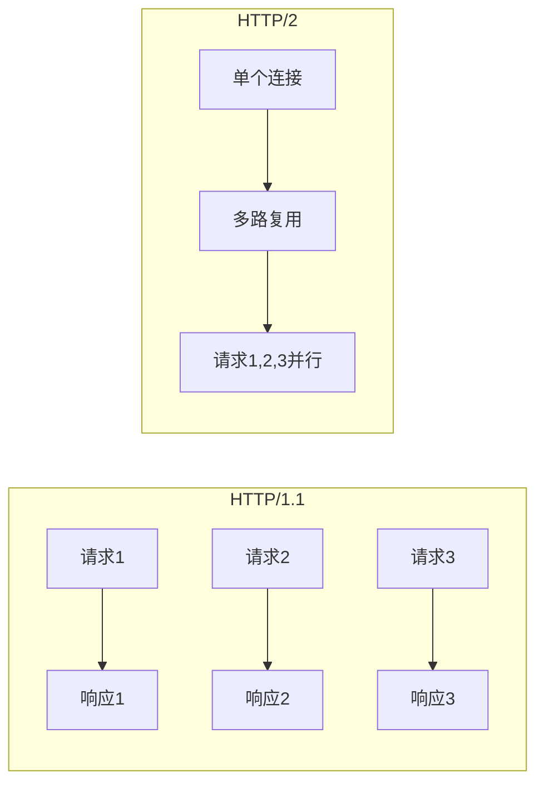
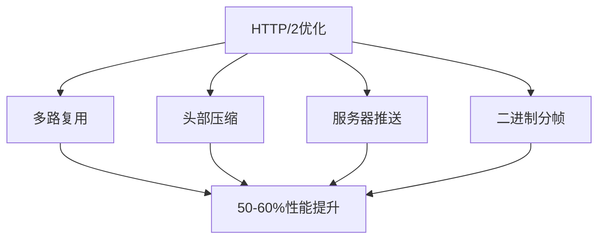
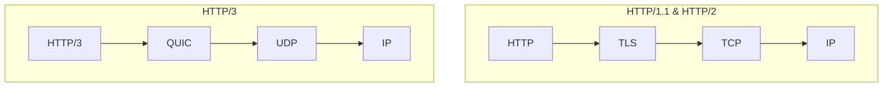

# HTTP 版本对比：从 HTTP/1.0 到 HTTP/3 的演进

HTTP（超文本传输协议）作为 Web 通信的基石，自 1991 年首次发布以来经历了多次重大更新。每个版本都带来了显著的性能提升和新功能。本文将深入探讨 HTTP 各个版本的特点、优缺点以及它们之间的区别。

<!-- truncate -->

## HTTP 协议发展历程



## HTTP/0.9 (1991 年)

HTTP/0.9 是最初的 HTTP 版本，设计极其简单。只支持 GET 方法，没有 HTTP 头部信息，只能传输 HTML 文档，服务器处理完请求后立即关闭连接。

请求示例：

```
GET /index.html
```

响应示例：

```
<html>
<body>Hello World</body>
</html>
```

## HTTP/1.0 (1996 年)

HTTP/1.0 引入了许多现代 HTTP 的基本概念，包括 POST 和 HEAD 方法、HTTP 头部（Headers）、状态码、不同的内容类型（Content-Type）支持。但每个请求都需要建立新的 TCP 连接。

请求示例：

```http
GET /index.html HTTP/1.0
Host: www.example.com
User-Agent: Mozilla/5.0

```

**主要问题：**

- 每个请求都需要建立和关闭 TCP 连接
- 无法复用连接，导致性能开销大
- 不支持虚拟主机

## HTTP/1.1 (1997 年)

HTTP/1.1 是目前使用最广泛的 HTTP 版本，带来了重大改进。

**核心特性：**

- **持久连接**：默认开启`Connection: keep-alive`，可以在一个 TCP 连接上发送多个 HTTP 请求
- **管道化**：可以在一个连接上同时发送多个请求，不需要等待前一个请求的响应
- **虚拟主机支持**：通过`Host`头部支持多个域名共享同一 IP
- **分块传输编码**：支持`Transfer-Encoding: chunked`，可以在不知道内容长度的情况下传输数据



**存在问题：**

- 队头阻塞（Head-of-Line Blocking）
- 管道化在实际中很少使用
- 每个连接一次只能处理一个请求

## HTTP/2 (2015 年)

HTTP/2 基于 Google 的 SPDY 协议，带来了革命性的改进。

**核心特性：**

- **多路复用**：在单个连接上并行处理多个请求，解决了队头阻塞问题
- **服务器推送**：服务器可以主动向客户端推送资源，减少往返次数
- **头部压缩**：使用 HPACK 算法压缩 HTTP 头部，减少传输数据量
- **二进制分帧**：使用二进制格式而非文本格式，提高解析效率





**部署要求：**

- 必须使用 HTTPS（在实际部署中）
- 需要服务器和客户端都支持

## HTTP/3 (2020 年)

HTTP/3 是最新的 HTTP 版本，基于 QUIC 协议。

**核心特性：**

- **基于 UDP 的 QUIC 协议**：摆脱了 TCP 的限制，内置加密，减少连接建立时间
- **解决队头阻塞**：在传输层解决了 TCP 层面的队头阻塞，每个流独立处理
- **连接迁移**：支持 IP 地址和端口的变化，移动设备切换网络时不会断开连接
- **0-RTT 连接建立**：在某些情况下可以实现零往返时间连接



**主要优势：**

- 更快的连接建立
- 更好的拥塞控制
- 内置安全性
- 减少延迟

## 版本对比总结

| 特性       | HTTP/1.0 | HTTP/1.1 | HTTP/2         | HTTP/3    |
| ---------- | -------- | -------- | -------------- | --------- |
| 连接方式   | 短连接   | 长连接   | 多路复用       | QUIC 连接 |
| 传输协议   | TCP      | TCP      | TCP            | UDP(QUIC) |
| 头部压缩   | 无       | 无       | HPACK          | QPACK     |
| 服务器推送 | 无       | 无       | 支持           | 支持      |
| 安全性     | 可选     | 可选     | 实际必须 HTTPS | 内置加密  |
| 队头阻塞   | 有       | 有       | 应用层解决     | 完全解决  |
