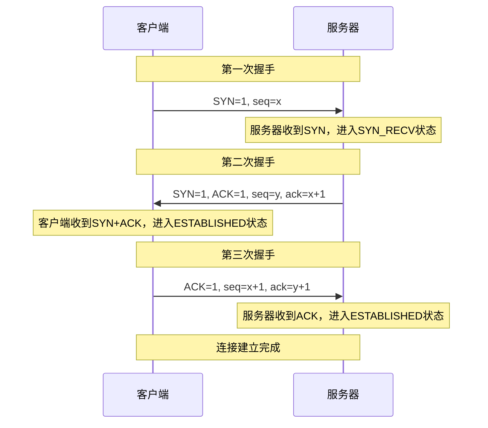
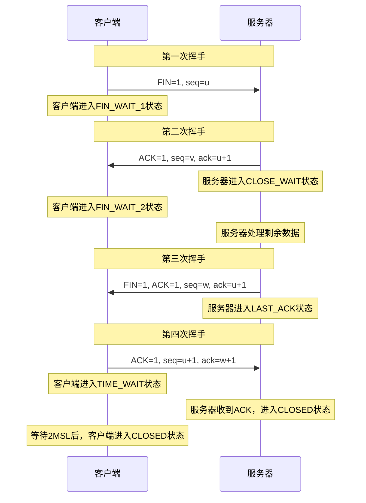

# TCP 三次握手与四次挥手详解

TCP（Transmission Control Protocol，传输控制协议）是互联网协议栈中的重要组成部分，它为网络通信提供可靠的、面向连接的数据传输服务。今天我们来深入了解 TCP 连接建立和断开的过程：三次握手和四次挥手。

<!-- truncate -->

## 为什么需要 TCP？

在开始讲解握手过程之前，让我们先了解为什么需要 TCP 协议：

- **可靠性**：确保数据包按顺序、完整地到达目的地
- **流量控制**：防止发送方发送数据过快，接收方来不及处理
- **拥塞控制**：避免网络拥堵
- **面向连接**：在数据传输前建立连接，传输后释放连接

## TCP 三次握手（连接建立）

TCP 三次握手是客户端和服务器建立连接的过程，确保双方都准备好进行数据传输。

### 握手过程

### 详细解释

1. **第一次握手（SYN）**

   - 客户端发送 SYN 包（SYN=1）到服务器
   - 包含客户端的初始序列号（seq=x）
   - 客户端进入 SYN_SENT 状态

2. **第二次握手（SYN+ACK）**

   - 服务器收到 SYN 包，发送 SYN+ACK 包作为响应
   - SYN=1，ACK=1，包含服务器的初始序列号（seq=y）
   - 确认号 ack=x+1，表示期望收到客户端的下一个数据包序列号
   - 服务器进入 SYN_RECV 状态

3. **第三次握手（ACK）**
   - 客户端收到 SYN+ACK 包，发送 ACK 包确认
   - ACK=1，seq=x+1，ack=y+1
   - 客户端进入 ESTABLISHED 状态
   - 服务器收到 ACK 包后，也进入 ESTABLISHED 状态

### 为什么需要三次握手？

**两次握手的问题**：

- 无法确认客户端的接收能力
- 可能导致已失效的连接请求报文突然又传送到了服务器

**三次握手的优势**：

- 确认双方的发送和接收能力都正常
- 防止已失效的连接请求报文段突然又传送到服务器
- 同步双方的初始序列号

## TCP 四次挥手（连接断开）

TCP 四次挥手是客户端和服务器断开连接的过程，确保所有数据都传输完成。

### 挥手过程

### 详细解释

1. **第一次挥手（FIN）**

   - 客户端发送 FIN 包（FIN=1），表示要关闭连接
   - 客户端进入 FIN_WAIT_1 状态

2. **第二次挥手（ACK）**

   - 服务器收到 FIN 包，发送 ACK 包确认
   - 服务器进入 CLOSE_WAIT 状态
   - 客户端收到 ACK 包，进入 FIN_WAIT_2 状态

3. **第三次挥手（FIN+ACK）**

   - 服务器处理完剩余数据后，发送 FIN+ACK 包
   - 服务器进入 LAST_ACK 状态

4. **第四次挥手（ACK）**
   - 客户端收到 FIN+ACK 包，发送 ACK 包确认
   - 客户端进入 TIME_WAIT 状态
   - 服务器收到 ACK 包，进入 CLOSED 状态
   - 客户端等待 2MSL（Maximum Segment Lifetime）后进入 CLOSED 状态

### 为什么需要四次挥手？

**TCP 是全双工通信**：

- 客户端的 FIN 只是表示客户端不再发送数据
- 服务器可能还有数据要发送给客户端
- 服务器需要单独发送 FIN 来关闭它到客户端的数据传输

**TIME_WAIT 状态的作用**：

- 确保最后一个 ACK 包能够到达服务器
- 防止"迷失"的数据包在新连接中出现

## 常见问题

### Q1: 为什么不能把服务器的 ACK 和 FIN 合并成一个包？

A1: 理论上可以，但实际情况中：

- 服务器收到客户端的 FIN 后，可能还有数据要发送
- 需要先 ACK 确认收到 FIN，然后处理完数据后再发送 FIN
- 这样设计更加灵活，确保数据完整性

### Q2: TIME_WAIT 状态为什么要等待 2MSL？

A2:

- MSL 是报文段在网络中的最大生存时间
- 等待 2MSL 确保最后一个 ACK 包能够到达服务器
- 如果服务器没收到 ACK，会重发 FIN 包，客户端可以重新发送 ACK

### Q3: 三次握手能否改为两次？

A3: 不能，因为：

- 无法确认客户端的接收能力
- 可能导致已失效的连接请求被服务器接受
- 无法可靠地同步双方的初始序列号

## 结语

TCP 的三次握手和四次挥手机制是网络通信可靠性的重要保障：

- **三次握手**确保连接建立时双方都准备就绪
- **四次挥手**确保连接断开时数据传输完整
- 这些机制虽然增加了网络开销，但保证了数据传输的可靠性

---

_参考资料：_

- RFC 793 - Transmission Control Protocol
- 计算机网络相关教材
