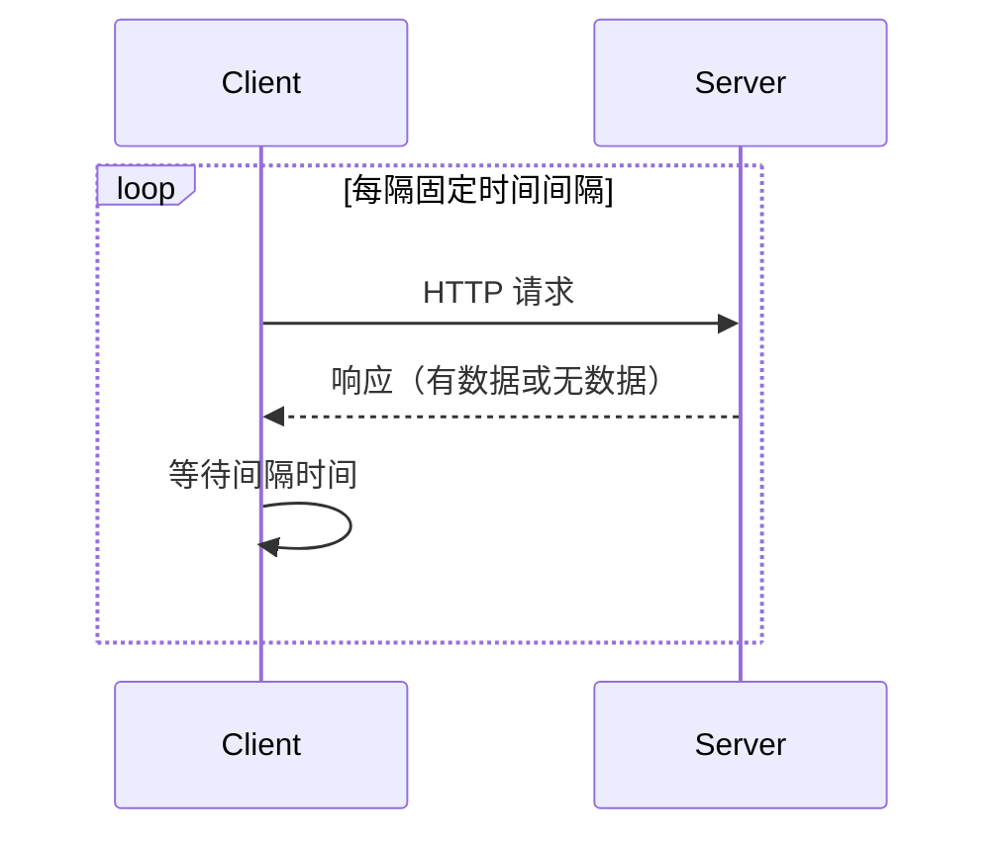
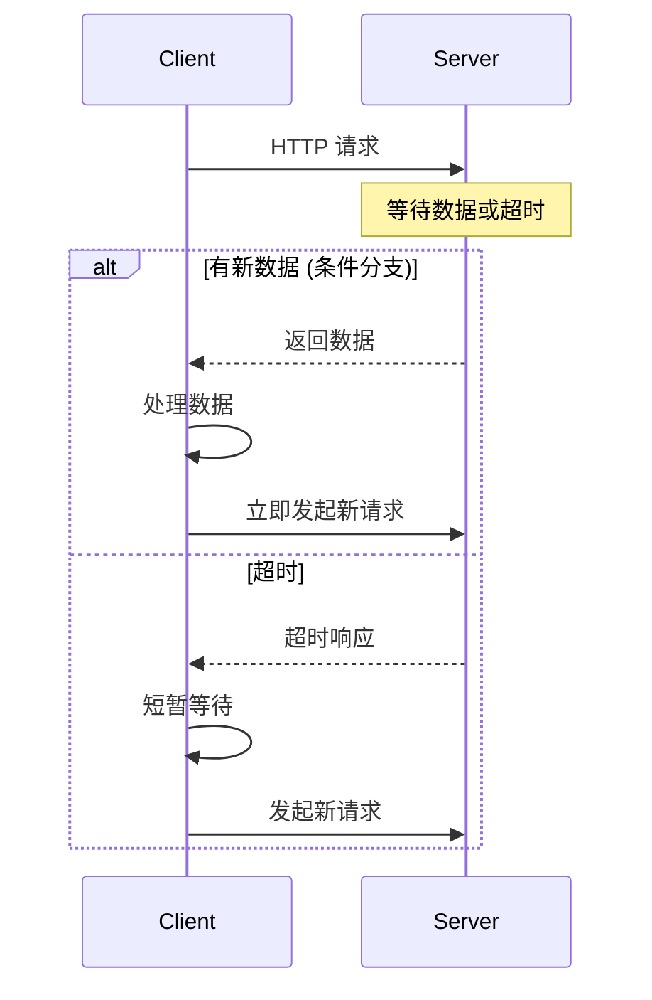
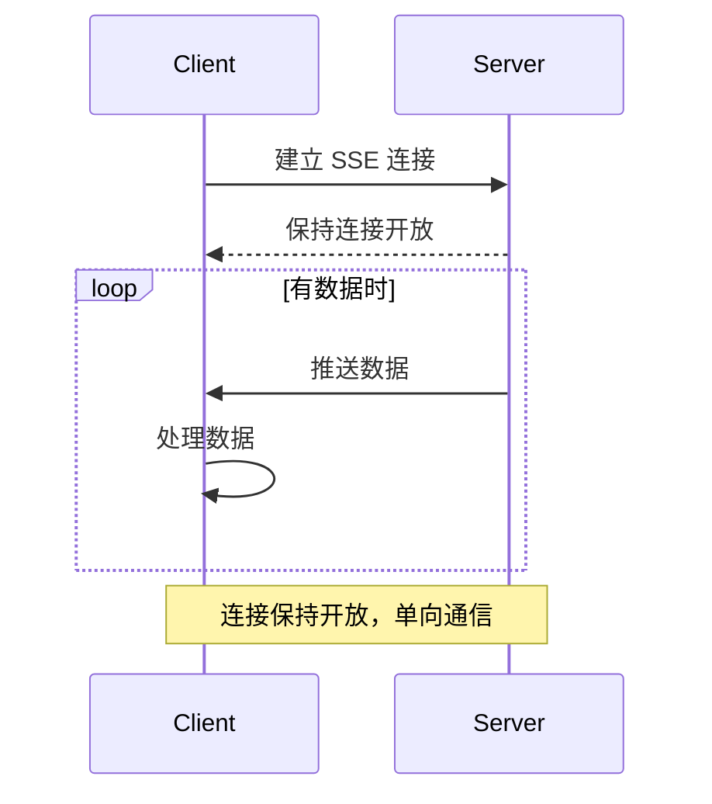
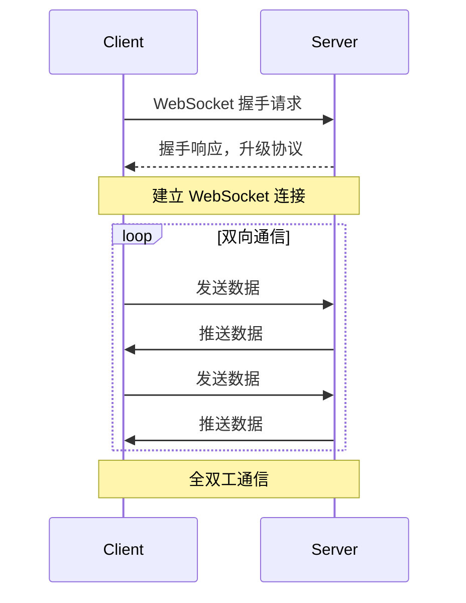

在现代 Web 应用中，实时通讯是一个重要的功能需求。无论是聊天应用、实时通知、协作工具，还是实时数据展示，都需要服务器向客户端推送数据。本文将详细介绍四种主要的实时通讯实现方式：短轮询、长轮询、SSE 和 WebSocket，并分析它们的优缺点和适用场景。

<!--truncate-->

## 1. 短轮询（Short Polling）

短轮询是最简单的实现方式，客户端定期向服务器发送请求，询问是否有新数据。



```javascript
// 客户端实现
function shortPolling() {
  const poll = async () => {
    try {
      const response = await fetch("/api/messages");
      const data = await response.json();

      if (data.messages.length > 0) {
        // 处理新消息
        handleNewMessages(data.messages);
      }
    } catch (error) {
      console.error("轮询失败:", error);
    }
  };

  // 每5秒轮询一次
  setInterval(poll, 5000);
}
```

**优点：** 实现简单，兼容性好，服务器压力相对均匀  
**缺点：** 实时性差，资源浪费，延迟高

## 2. 长轮询（Long Polling）

长轮询在短轮询的基础上进行了优化，服务器在有数据时才返回响应，否则保持连接直到超时。



```javascript
// 客户端实现
function longPolling() {
  const poll = async () => {
    try {
      const response = await fetch("/api/messages/long-poll", {
        signal: AbortSignal.timeout(30000),
      });
      const data = await response.json();
      if (data.messages.length > 0) {
        handleNewMessages(data.messages);
      }
      setTimeout(poll, 100);
    } catch (error) {
      console.error("长轮询失败:", error);
      setTimeout(poll, 5000);
    }
  };
  poll();
}

// 服务器端实现（Node.js Express）
app.get("/api/messages/long-poll", (req, res) => {
  const timeout = setTimeout(() => {
    res.json({ messages: [] });
  }, 30000);

  const messageHandler = (messages) => {
    clearTimeout(timeout);
    res.json({ messages });
  };

  messageQueue.addWaitingClient(messageHandler);

  req.on("close", () => {
    clearTimeout(timeout);
    messageQueue.removeWaitingClient(messageHandler);
  });
});
```

**优点：** 实时性较好，减少无效请求，兼容性好  
**缺点：** 服务器需要维护大量长连接，消耗资源，网络异常时处理复杂

## 3. Server-Sent Events (SSE)

SSE 是 HTML5 标准的一部分，允许服务器向客户端推送数据，建立单向的实时通信通道。



```javascript
// 客户端实现
function setupSSE() {
  const eventSource = new EventSource("/api/messages/sse");

  eventSource.onmessage = function (event) {
    const data = JSON.parse(event.data);
    handleNewMessages(data.messages);
  };

  eventSource.onerror = function (error) {
    console.error("SSE 连接错误:", error);
  };

  // 自定义事件类型
  eventSource.addEventListener("notification", function (event) {
    const notification = JSON.parse(event.data);
    showNotification(notification);
  });
}

// 服务器端实现（Node.js Express）
app.get("/api/messages/sse", (req, res) => {
  res.writeHead(200, {
    "Content-Type": "text/event-stream",
    "Cache-Control": "no-cache",
    Connection: "keep-alive",
  });

  res.write('data: {"type": "connected"}\n\n');
  const clientId = addSSEClient(res);

  req.on("close", () => {
    removeSSEClient(clientId);
  });
});
```

**优点：** 真正的服务器推送，自动重连机制，支持自定义事件类型  
**缺点：** 仅支持单向通信，浏览器连接数限制，不支持二进制数据

## 4. WebSocket

WebSocket 是一种全双工通信协议，在单个 TCP 连接上提供双向通信通道。



```javascript
// 客户端实现
function setupWebSocket() {
  const ws = new WebSocket("ws://localhost:3000");

  ws.onopen = function (event) {
    console.log("WebSocket 连接已建立");
    ws.send(JSON.stringify({ type: "auth", token: "user-token" }));
  };

  ws.onmessage = function (event) {
    const data = JSON.parse(event.data);
    switch (data.type) {
      case "message":
        handleNewMessages(data.messages);
        break;
      case "ping":
        ws.send(JSON.stringify({ type: "pong" }));
        break;
    }
  };

  ws.onclose = function (event) {
    console.log("WebSocket 连接已关闭");
    setTimeout(setupWebSocket, 3000);
  };

  // 发送消息
  window.sendMessage = function (message) {
    if (ws.readyState === WebSocket.OPEN) {
      ws.send(JSON.stringify({ type: "message", content: message }));
    }
  };
}

// 服务器端实现（Node.js ws库）
const WebSocket = require("ws");
const wss = new WebSocket.Server({ port: 3000 });

wss.on("connection", function connection(ws) {
  ws.on("message", function incoming(message) {
    const data = JSON.parse(message);
    switch (data.type) {
      case "auth":
        handleAuth(ws, data.token);
        break;
      case "message":
        broadcastMessage(data.content);
        break;
    }
  });

  // 心跳检测
  ws.isAlive = true;
  ws.on("pong", () => (ws.isAlive = true));
});
```

**优点：** 真正的双向通信，低延迟，支持二进制数据，协议开销小  
**缺点：** 实现复杂度高，需要处理连接管理和重连，代理服务器可能不支持

## 技术对比与选择

| 特性           | 短轮询 | 长轮询 | SSE  | WebSocket |
| -------------- | ------ | ------ | ---- | --------- |
| 实时性         | 差     | 中等   | 好   | 最好      |
| 服务器资源消耗 | 中等   | 高     | 中等 | 低        |
| 实现复杂度     | 简单   | 中等   | 简单 | 复杂      |
| 浏览器兼容性   | 最好   | 最好   | 好   | 好        |
| 双向通信       | 是     | 是     | 否   | 是        |
| 二进制支持     | 是     | 是     | 否   | 是        |

**选择建议：**

- **短轮询**：对实时性要求不高的应用，简单的状态查询
- **长轮询**：中等实时性要求，需要兼容老旧浏览器的场景
- **SSE**：单向数据推送（新闻推送、股票价格、实时日志）
- **WebSocket**：实时聊天、在线游戏、协作编辑、实时数据监控
