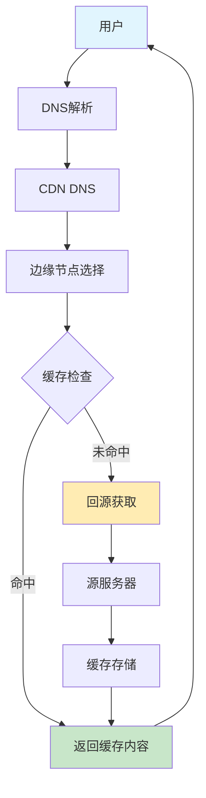
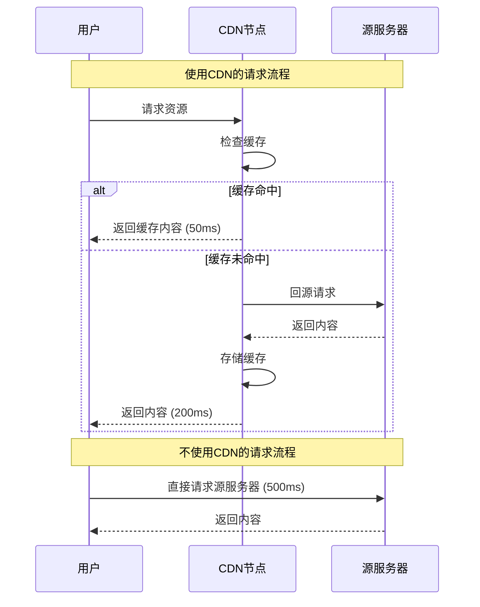
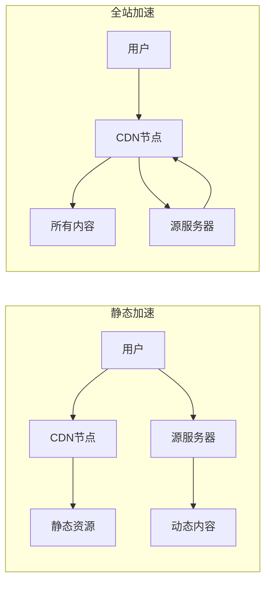

在现代互联网时代，网站的加载速度直接影响用户体验和业务成功。CDN（Content Delivery Network，内容分发网络）作为提升网站性能的重要技术，已经成为大型网站和应用的标配。

<!--truncate-->

## 什么是 CDN？

CDN（Content Delivery Network）是一个分布式服务器网络，通过在全球各地部署缓存服务器，将内容缓存到距离用户最近的节点，从而加快内容传输速度，提升用户访问体验。

简单来说，CDN 就像是在全世界建立了很多个"仓库"，把你的网站内容提前存储在这些仓库里，当用户访问时，就从最近的仓库取货，而不用跑到源头去拿。

## CDN 工作原理

### 详细流程：

1. **用户请求**：用户在浏览器中输入网址或点击链接
2. **DNS 解析**：域名解析到 CDN 提供商的 DNS 服务器
3. **节点选择**：CDN 根据用户地理位置、网络状况等选择最优节点
4. **缓存检查**：边缘节点检查是否有缓存的内容
5. **内容返回**：如果有缓存则直接返回，否则回源获取并缓存

## CDN 的核心优势

**主要优势：**

- **提升加载速度**：就近访问，减少延迟，提高响应速度
- **减轻服务器压力**：流量分担，并发处理，防护 DDoS 攻击
- **提高可用性**：故障转移，负载均衡，多重备份保障

## CDN 适用内容与部署策略

**适用的内容类型：**

- **静态资源**（最适合）：图片、CSS、JavaScript 等文件
- **动态内容**（部分适合）：API 响应、新闻数据等可缓存内容
- **流媒体内容**：视频流、音频流、直播流等

**部署策略选择：**

- **静态加速**：只缓存静态资源，动态内容直接回源
- **全站加速**：所有内容都通过 CDN，包括动态内容
- **多 CDN 策略**：使用多个 CDN 服务商，提高可用性和性能

**CDN 的技术特点：**

- **缓存策略**：根据内容类型设置不同的缓存时间，静态资源可长期缓存，动态内容短期缓存
- **智能路由**：根据用户地理位置、网络状况、服务器负载等因素选择最优节点
- **内容压缩**：自动压缩文本、图片等资源，减少传输数据量
- **安全防护**：提供 DDoS 防护、Web 应用防火墙等安全功能

**CDN 的工作机制：**

1. **内容预取**：将热门内容提前缓存到边缘节点
2. **实时同步**：内容更新时，及时清理过期缓存
3. **负载均衡**：在多个节点间分配请求，避免单点过载
4. **故障转移**：节点故障时自动切换到备用节点

## CDN 应用场景与效果

**典型应用场景：**

1. **电商网站**：商品图片、促销页面等静态资源加速
2. **新闻媒体**：文章、图片、视频内容的快速分发
3. **在线教育**：视频课程、课件资源的全球传输
4. **游戏平台**：游戏更新包、素材资源的下载加速
5. **企业官网**：品牌展示、产品介绍等内容的优化加载

**性能提升效果：**

- **加载速度**：页面加载时间可减少 50-80%
- **用户体验**：减少等待时间，提高页面响应速度
- **服务器负载**：减少源服务器 60-90% 的带宽消耗
- **可用性**：提供 99.9% 以上的服务可用性

**CDN 的关键指标：**

- **缓存命中率**：通常应达到 85% 以上
- **响应时间**：边缘节点响应时间应低于 100ms
- **带宽节省**：可节省 60-90% 的源站带宽
- **全球覆盖**：支持全球用户的就近访问
