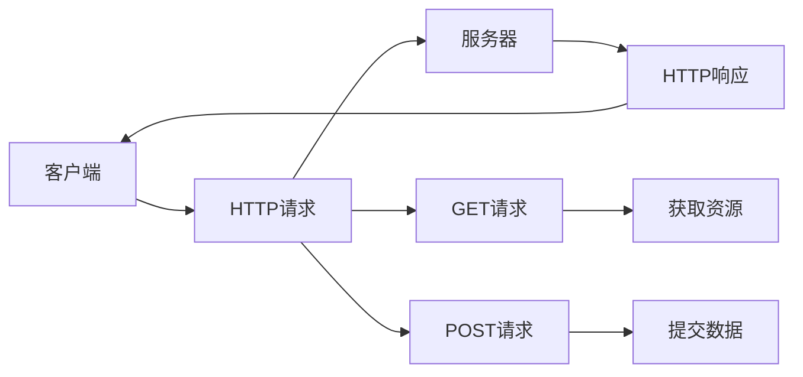
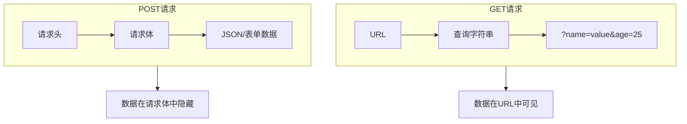
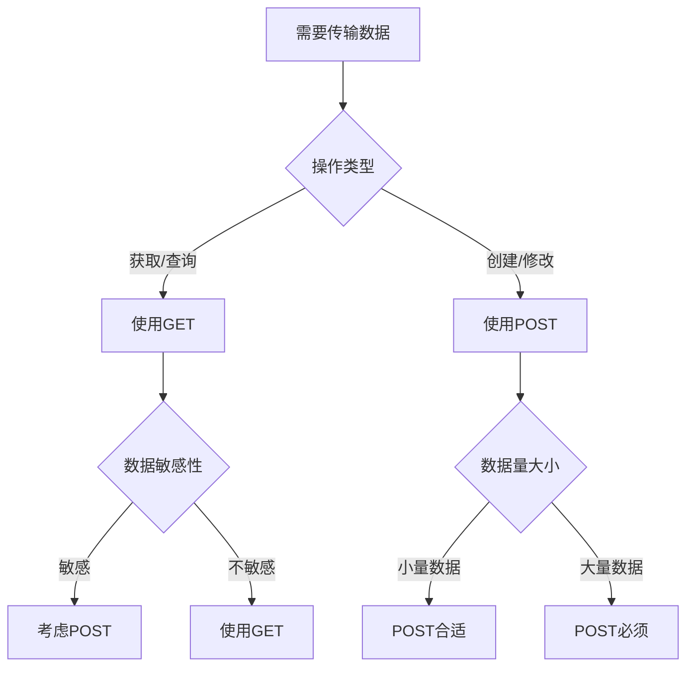

# GET vs POST：深入理解两种 HTTP 请求方法的区别

在 Web 开发中，HTTP 请求方法是客户端与服务器通信的基础。其中，GET 和 POST 是最常用的两种请求方法。虽然它们都能完成数据传输，但在设计理念、使用场景和技术特性上存在显著差异。

<!-- truncate -->

## HTTP 请求方法概述

HTTP 协议定义了多种请求方法，每种方法都有其特定的语义和用途。GET 和 POST 作为最基础的两种方法，承担着绝大多数的 Web 交互任务。



## 核心区别对比

### 1. 设计目的

- **GET**：用于从服务器获取资源，是幂等的（多次执行结果相同）
- **POST**：用于向服务器提交数据，通常会改变服务器状态

### 2. 数据传输方式



**GET 请求示例：**

```
GET /api/users?id=123&name=john HTTP/1.1
Host: example.com
```

**POST 请求示例：**

```
POST /api/users HTTP/1.1
Host: example.com
Content-Type: application/json

{
  "id": 123,
  "name": "john",
  "email": "john@example.com"
}
```

### 3. 数据长度限制

| 特性     | GET                               | POST           |
| -------- | --------------------------------- | -------------- |
| 数据长度 | 受 URL 长度限制（通常 2048 字符） | 理论上无限制   |
| 数据类型 | 仅支持 ASCII 字符                 | 支持二进制数据 |
| 数据位置 | URL 查询字符串                    | 请求体         |

### 4. 安全性对比

| 安全性方面 | GET 请求                   | POST 请求                 |
| ---------- | -------------------------- | ------------------------- |
| 数据可见性 | URL 中可见，易被记录       | 数据在请求体中，相对隐藏  |
| 浏览器历史 | 会保存在历史记录中         | 不会保存在历史记录中      |
| 服务器日志 | 参数会记录在访问日志中     | 参数不会记录在访问日志中  |
| 缓存风险   | 可能被缓存，存在泄露风险   | 默认不缓存，风险较低      |
| 书签分享   | URL 包含敏感信息可能被分享 | 无法通过 URL 分享敏感信息 |
| 网络传输   | 参数在 URL 中明文传输      | 需要 HTTPS 加密保护       |
| 安全等级   | 较低，不适合敏感数据       | 较高，适合敏感数据传输    |

## 详细特性分析

### 优缺点对比

| 特性类别 | GET 请求                                                                                                                                                                       | POST 请求                                                                                                                                                  |
| -------- | ------------------------------------------------------------------------------------------------------------------------------------------------------------------------------ | ---------------------------------------------------------------------------------------------------------------------------------------------------------- |
| **优点** | • 可缓存：浏览器和代理服务器可以缓存 GET 请求<br />• 可收藏：URL 包含所有信息，便于书签保存<br />• 可分享：完整的 URL 可以直接分享给他人<br />• 幂等性：多次执行不会产生副作用 | • 数据隐藏：数据在请求体中，相对安全<br />• 无长度限制：可传输大量数据<br />• 数据类型丰富：支持文本、二进制、文件等<br />• 语义明确：明确表示数据提交操作 |
| **缺点** | • 安全性较低：参数暴露在 URL 中<br />• 数据长度限制：受 URL 长度限制<br />• 数据类型限制：只能传输文本数据                                                                     | • 不可缓存：默认情况下不被缓存<br />• 不可收藏：无法通过 URL 重现请求<br />• 需要额外配置：可能需要 CSRF 保护                                              |

### 适用场景对比

| 场景类型     | GET 请求                                                                         | POST 请求                                                                |
| ------------ | -------------------------------------------------------------------------------- | ------------------------------------------------------------------------ |
| **数据获取** | ✅ 获取数据（如查询用户信息）<br />✅ 搜索操作<br />✅ 分页查询<br />✅ 资源访问 | ❌ 不适用于数据获取                                                      |
| **数据提交** | ❌ 不适用于敏感数据提交<br />⚠️ 可用于简单查询参数                               | ✅ 提交表单数据<br />✅ 文件上传<br />✅ 创建新资源<br />✅ 修改数据操作 |
| **其他用途** | ✅ API 查询接口<br />✅ 静态资源请求<br />✅ 页面跳转                            | ✅ 用户认证<br />✅ 数据更新<br />✅ 批量操作                            |

## 选择原则



### 安全建议

1. **敏感数据**：永远不要在 GET 请求中传输敏感信息
2. **HTTPS**：对于重要应用，始终使用 HTTPS
3. **参数验证**：无论 GET 还是 POST，都要验证输入参数
4. **CSRF 保护**：POST 请求需要防范 CSRF 攻击

### 性能优化

1. **合理使用缓存**：对于 GET 请求，设置合适的缓存策略
2. **URL 设计**：GET 请求的 URL 应该简洁明了
3. **数据压缩**：对于 POST 请求，考虑使用 gzip 压缩

## 小结

GET 和 POST 请求各有其适用场景：

- **GET**：适合获取数据、查询操作，具有幂等性，可缓存，但安全性较低
- **POST**：适合提交数据、修改操作，数据隐藏性好，支持大数据量，但不可缓存

---

_参考资料：_

- [RFC 7231 - HTTP/1.1 Semantics and Content](https://tools.ietf.org/html/rfc7231)
- [MDN HTTP Methods](https://developer.mozilla.org/en-US/docs/Web/HTTP/Methods)
