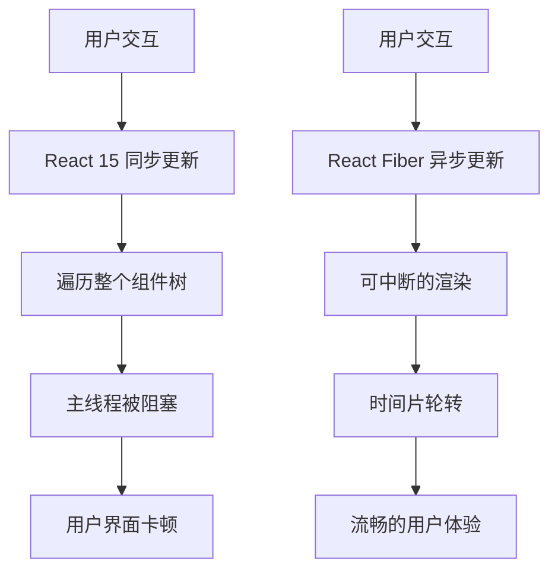
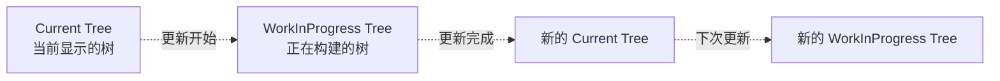
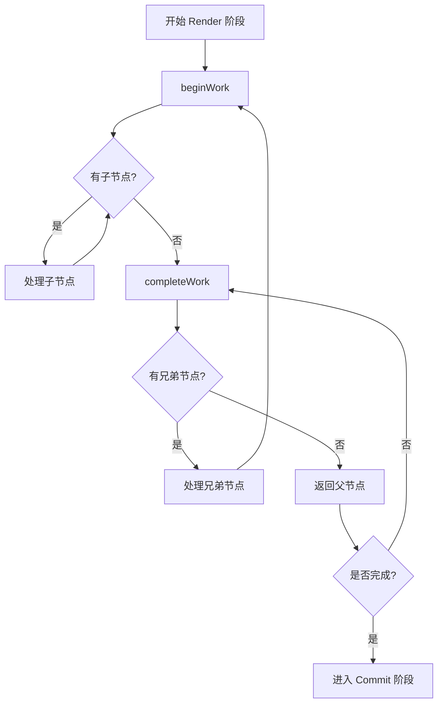
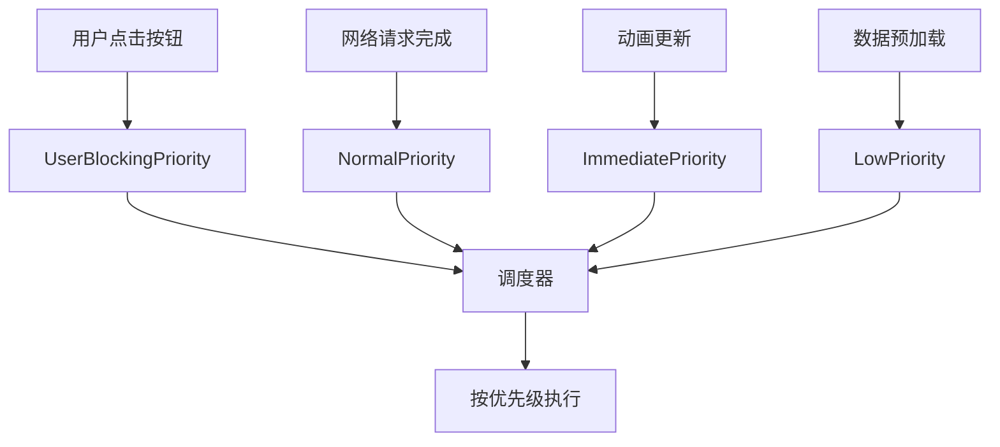

# React Fiber ：理解 React 的协调算法

React Fiber 是 React 16 引入的新协调引擎，它彻底改变了 React 更新组件的方式。通过可中断的渲染和优先级调度，Fiber 让 React 应用变得更加流畅和响应迅速。

<!-- truncate -->

## 什么是 React Fiber

React Fiber 是 React 核心算法的重新实现，它的主要目标是提高 React 在动画、布局和手势等领域的适用性。Fiber 引入了可中断的渲染和优先级调度，使得 React 能够在保持应用响应性的同时处理复杂的更新。

### Fiber 解决的问题

在 React 15 及之前的版本中，协调过程是同步且不可中断的。这意味着一旦开始更新，React 必须完成整个组件树的遍历才能释放主线程。对于大型应用，这可能导致：

- **阻塞用户交互**：长时间的同步更新会阻塞用户输入
- **动画卡顿**：无法及时响应动画帧的更新
- **性能问题**：主线程被长时间占用



## Fiber 的核心概念

### 1. Fiber 节点

每个 React 元素都对应一个 Fiber 节点，Fiber 节点包含了组件的类型、props、state 和其他元数据。

```javascript
// 简化的 Fiber 节点结构
const fiberNode = {
  type: "div", // 组件类型
  props: { className: "container" }, // 属性
  stateNode: domElement, // 对应的 DOM 节点
  child: childFiber, // 第一个子节点
  sibling: siblingFiber, // 兄弟节点
  return: parentFiber, // 父节点
  effectTag: "UPDATE", // 副作用标记
  expirationTime: 1000, // 过期时间
};
```

### 2. 双缓冲技术

Fiber 使用双缓冲技术来管理组件树：

- **Current Tree**：当前显示在屏幕上的 Fiber 树
- **WorkInProgress Tree**：正在构建的新 Fiber 树



### 3. 时间片和调度

Fiber 将渲染工作分解为小的时间片，每个时间片大约 5ms。在每个时间片结束时，React 会检查是否有更高优先级的任务需要处理。

```javascript
// React 调度器的简化逻辑
function workLoop() {
  while (workInProgress && !shouldYield()) {
    workInProgress = performUnitOfWork(workInProgress);
  }

  if (workInProgress) {
    // 还有工作要做，但时间片用完了
    // 让出控制权，等待下一个时间片
    return continueWork;
  } else {
    // 工作完成，提交更改
    commitRoot();
  }
}
```

## Fiber 的工作阶段

Fiber 的工作分为两个主要阶段：

### 1. Render 阶段（可中断）

在这个阶段，React 会：

- 遍历组件树
- 调用生命周期方法（如 `componentWillMount`）
- 计算新的 state 和 props
- 标记需要更新的节点



### 2. Commit 阶段（不可中断）

在这个阶段，React 会：

- 应用所有的 DOM 更改
- 调用生命周期方法（如 `componentDidMount`）
- 执行副作用（effects）

```javascript
// Commit 阶段的主要步骤
function commitRoot(root) {
  // 阶段1：执行 DOM 操作前的副作用
  commitBeforeMutationEffects();

  // 阶段2：执行 DOM 操作
  commitMutationEffects();

  // 阶段3：执行 DOM 操作后的副作用
  commitLayoutEffects();
}
```

## 优先级调度

Fiber 引入了优先级概念，不同类型的更新有不同的优先级：

```javascript
// React 优先级（从高到低）
const priorities = {
  ImmediatePriority: 1, // 同步任务，立即执行
  UserBlockingPriority: 2, // 用户交互，需要快速响应
  NormalPriority: 3, // 普通更新
  LowPriority: 4, // 低优先级更新
  IdlePriority: 5, // 空闲时执行
};
```



## 实际应用示例

让我们看一个实际的例子，了解 Fiber 如何提升用户体验：

```jsx
import React, { useState, useTransition } from "react";

function App() {
  const [input, setInput] = useState("");
  const [list, setList] = useState([]);
  const [isPending, startTransition] = useTransition();

  const handleChange = (e) => {
    // 高优先级更新：立即更新输入框
    setInput(e.target.value);

    // 低优先级更新：使用 transition 包装耗时操作
    startTransition(() => {
      const newList = [];
      for (let i = 0; i < 10000; i++) {
        newList.push(`${e.target.value} - ${i}`);
      }
      setList(newList);
    });
  };

  return (
    <div>
      <input value={input} onChange={handleChange} />
      {isPending && <div>Loading...</div>}
      <ul>
        {list.map((item, index) => (
          <li key={index}>{item}</li>
        ))}
      </ul>
    </div>
  );
}
```

在这个例子中：

- 输入框的更新具有高优先级，确保用户输入不会卡顿
- 列表的更新使用 `useTransition` 标记为低优先级，不会阻塞用户交互

## Fiber 带来的好处

### 1. 更好的用户体验

- 响应更快的用户交互
- 更流畅的动画
- 避免长时间的页面阻塞

### 2. 更灵活的渲染控制

- 可以暂停和恢复渲染
- 支持时间切片
- 优先级调度

### 3. 更好的错误处理

- Error Boundaries 的改进
- 更精确的错误定位

## 与 React 15 的对比

| 特性     | React 15       | React Fiber    |
| -------- | -------------- | -------------- |
| 渲染方式 | 同步递归       | 异步可中断     |
| 优先级   | 无优先级概念   | 支持优先级调度 |
| 用户体验 | 可能出现卡顿   | 更流畅的交互   |
| 错误处理 | 有限的错误边界 | 更好的错误恢复 |

## 结语

React Fiber 是 React 的一次重大架构升级，它通过引入可中断的渲染和优先级调度，显著提升了 React 应用的性能和用户体验。虽然 Fiber 的内部实现相当复杂，但对于开发者来说，大部分变化是透明的，我们可以继续使用熟悉的 React API，同时享受 Fiber 带来的性能提升。

理解 Fiber 的工作原理有助于我们：

- 更好地优化 React 应用性能
- 合理使用 React 18 的新特性（如 Concurrent Features）
- 编写更高效的组件代码

React Fiber 为 React 的未来发展奠定了坚实的基础，它不仅解决了当前的性能问题，也为未来的新特性（如 Suspense、Concurrent Mode 等）提供了技术支撑。
