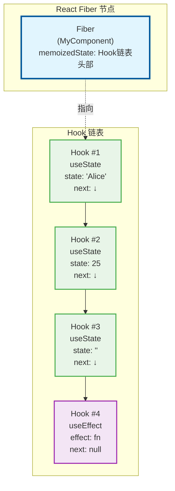
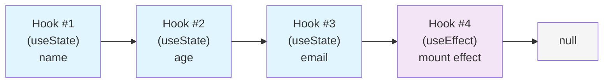
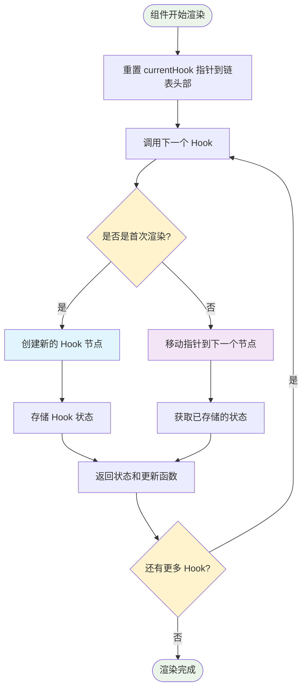
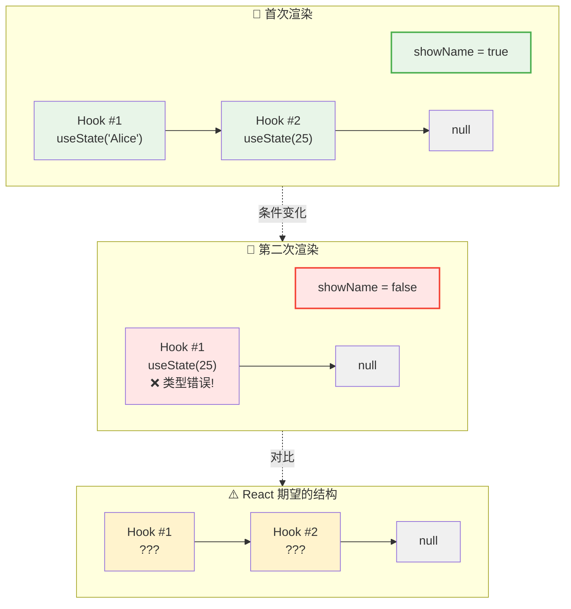
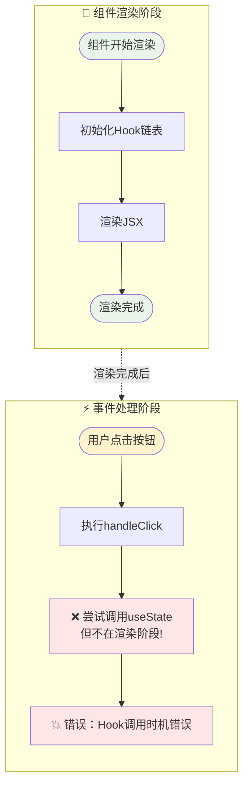
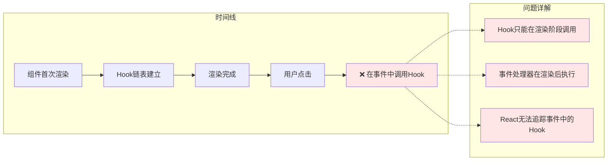

React Hooks 的出现彻底改变了我们编写 React 组件的方式，但随之而来的是一些严格的使用规则。其中最重要的一条就是：**只能在函数组件的顶层调用 Hooks，不能在循环、条件判断或嵌套函数中调用**。

今天我们就来探讨这条规则背后的原理，以及为什么违反这条规则会导致问题。

<!-- truncate -->

## Hook 规则回顾

在深入原理之前，让我们回顾一下 React Hooks 的基本规则：

1. **只在最顶层使用 Hook** - 不要在循环、条件或嵌套函数中调用 Hook
2. **只在 React 函数中调用 Hook** - 不要在普通的 JavaScript 函数中调用 Hook

```jsx
// ❌ 错误：在条件中调用 Hook
function MyComponent({ shouldUseEffect }) {
  if (shouldUseEffect) {
    useEffect(() => {
      // 一些副作用
    }, []);
  }
}

// ❌ 错误：在循环中调用 Hook
function MyComponent({ items }) {
  items.forEach((item) => {
    const [value, setValue] = useState(item.defaultValue);
  });
}

// ❌ 错误：在嵌套函数中调用 Hook
function MyComponent() {
  const handleClick = () => {
    const [count, setCount] = useState(0);
  };
}
```

## React 内部的 Hook 链表机制

要理解为什么有这些规则，我们需要了解 React 内部是如何管理 Hooks 的。

### Fiber 节点与 Hook 链表

在 React 内部，每个函数组件都对应一个 Fiber 节点。这个 Fiber 节点有一个 `memoizedState` 属性，用来存储该组件的所有 Hook 状态。



```javascript
// React 内部的简化结构
const fiber = {
  memoizedState: null, // 指向第一个 Hook
  // 其他属性...
};
```

所有的 Hooks 通过链表的形式连接起来：

```javascript
// Hook 节点的简化结构
const hook = {
  memoizedState: null, // 该 Hook 的状态值
  next: null, // 指向下一个 Hook
  // 其他属性...
};
```

### Hook 调用的执行过程

让我们看一个简单的例子：

```jsx
function MyComponent() {
  const [name, setName] = useState("Alice"); // Hook #1
  const [age, setAge] = useState(25); // Hook #2
  const [email, setEmail] = useState(""); // Hook #3

  useEffect(() => {
    console.log("Component mounted");
  }, []); // Hook #4

  return (
    <div>
      {name} - {age}
    </div>
  );
}
```

在这个组件中，React 会创建一个包含 4 个节点的链表：



### 渲染过程中的 Hook 遍历

当组件重新渲染时，React 会按照以下流程处理 Hook：



React 内部的简化逻辑：

```javascript
// React 内部的简化逻辑
let currentHook = null;

function useState(initialValue) {
  // 首次渲染
  if (currentHook === null) {
    currentHook = createNewHook(initialValue);
    fiber.memoizedState = currentHook;
  } else {
    // 重新渲染：移动到下一个 Hook
    currentHook = currentHook.next;
  }

  return [currentHook.memoizedState, currentHook.dispatch];
}
```

## 为什么不能在条件中调用 Hooks？

现在让我们看看如果在条件中调用 Hook 会发生什么：

```jsx
function MyComponent({ showName }) {
  // 首次渲染：showName = true
  if (showName) {
    const [name, setName] = useState("Alice"); // Hook #1
  }
  const [age, setAge] = useState(25); // Hook #2

  // 第二次渲染：showName = false
  // if 条件不满足，useState('Alice') 没有被调用
  // 但 React 期望在 Hook #1 的位置找到第一个 useState
  // 实际上却找到了 useState(25)！
}
```

**问题分析：**



**结果**：React 在 Hook #1 的位置期望找到 `useState('Alice')`，但实际找到的是 `useState(25)`，导致状态混乱。

## 为什么不能在循环中调用 Hooks？

循环中的问题类似，但更加复杂：

```jsx
function MyComponent({ items }) {
  // 首次渲染：items = ['a', 'b', 'c']
  items.forEach((item) => {
    const [value, setValue] = useState(item);
  });

  // 第二次渲染：items = ['a', 'b'] (删除了一个项目)
  items.forEach((item) => {
    const [value, setValue] = useState(item);
  });
}
```



```mermaid
flowchart TB
    subgraph render1 ["🔄 首次渲染"]
        direction LR
        state1["items = ['a', 'b', 'c']"]
        A1["Hook #1<br/>useState('a')"] --> A2["Hook #2<br/>useState('b')"] --> A3["Hook #3<br/>useState('c')"] --> A4["null"]
    end

    subgraph render2 ["🔄 第二次渲染"]
        direction LR
        state2["items = ['a', 'b']"]
        B1["Hook #1<br/>useState('a')"] --> B2["Hook #2<br/>useState('b')"] --> B3["❌ 缺少 Hook #3!"]
    end

    subgraph expected ["⚠️ React 仍然期望完整链表"]
        direction LR
        C1["Hook #1"] --> C2["Hook #2"] --> C3["Hook #3<br/>❌ 找不到!"] --> C4["null"]
    end

    render1 -.->|数组长度变化| render2
    render2 -.->|但是...| expected

    style state1 fill:#e8f5e8,stroke:#4caf50,stroke-width:2px
    style state2 fill:#ffe6e6,stroke:#f44336,stroke-width:2px
    style A1 fill:#e8f5e8
    style A2 fill:#e8f5e8
    style A3 fill:#e8f5e8
    style A4 fill:#f0f0f0
    style B1 fill:#e8f5e8
    style B2 fill:#e8f5e8
    style B3 fill:#ffe6e6
    style C1 fill:#fff3cd
    style C2 fill:#fff3cd
    style C3 fill:#ffe6e6
    style C4 fill:#f0f0f0
```

## 为什么不能在嵌套函数中调用 Hooks？

嵌套函数中调用 Hook 的问题与前面两种情况不同，它涉及的是 Hook 调用时机的问题：

```jsx
function MyComponent() {
  const handleClick = () => {
    const [count, setCount] = useState(0); // ❌ 错误！
  };

  return <button onClick={handleClick}>Click me</button>;
}
```

**问题分析：**



**核心问题：**

1. **调用时机错误** - Hook 只能在组件渲染期间调用，不能在事件处理器中调用
2. **Hook 链表破坏** - 每次点击都尝试创建新的 Hook，但此时 Hook 链表已经固定
3. **状态管理混乱** - 在错误的时机创建状态，无法被 React 正确追踪

**具体错误场景：**



## 正确的解决方案

### 1. 条件渲染的正确方式

```jsx
// ❌ 错误
function MyComponent({ showName }) {
  if (showName) {
    const [name, setName] = useState("Alice");
  }
}

// ✅ 正确
function MyComponent({ showName }) {
  const [name, setName] = useState("Alice");

  if (showName) {
    return <div>{name}</div>;
  }
  return <div>Name hidden</div>;
}
```

### 2. 动态列表的正确方式

```jsx
// ❌ 错误
function MyComponent({ items }) {
  items.forEach((item) => {
    const [value, setValue] = useState(item);
  });
}

// ✅ 正确：将每个项目作为独立组件
function ItemComponent({ item }) {
  const [value, setValue] = useState(item);
  return <div>{value}</div>;
}

function MyComponent({ items }) {
  return (
    <div>
      {items.map((item) => (
        <ItemComponent key={item.id} item={item} />
      ))}
    </div>
  );
}
```

### 3. 事件处理的正确方式

```jsx
// ❌ 错误
function MyComponent() {
  const handleClick = () => {
    const [count, setCount] = useState(0);
  };
}

// ✅ 正确
function MyComponent() {
  const [count, setCount] = useState(0);

  const handleClick = () => {
    setCount((prev) => prev + 1);
  };

  return <button onClick={handleClick}>Count: {count}</button>;
}
```

## 结语

React Hooks 的调用规则看似严格，但这些规则确保了：

1. **状态的一致性** - 每次渲染时，Hook 的调用顺序必须保持一致
2. **性能优化** - React 可以通过链表位置快速定位到对应的 Hook 状态
3. **可预测性** - 组件的行为在不同渲染之间保持可预测
