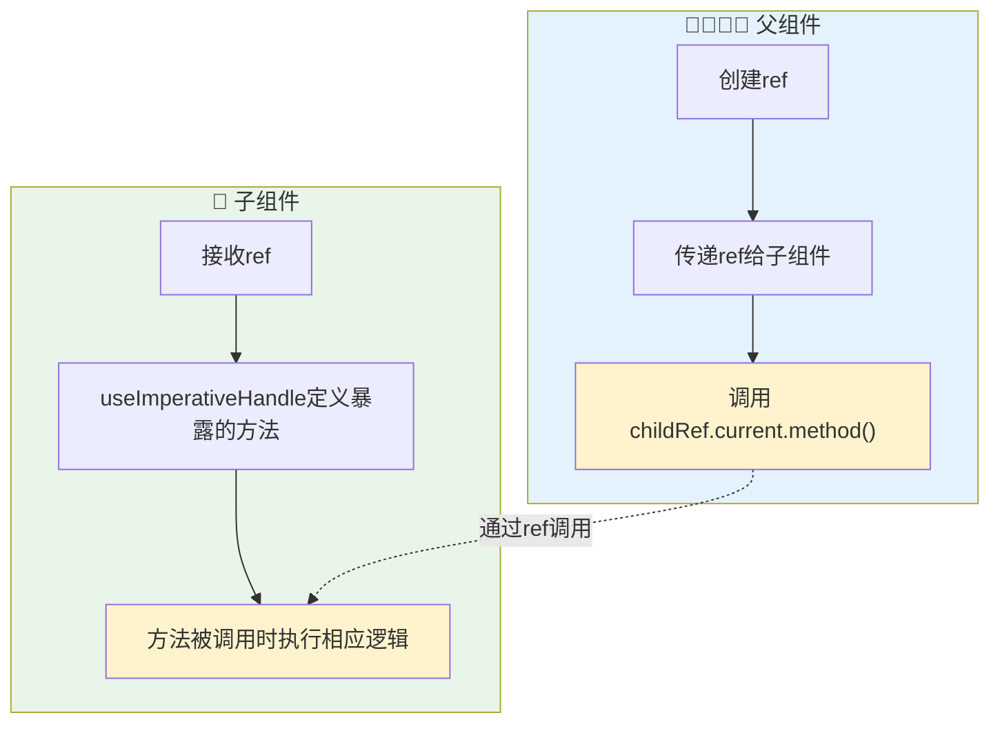
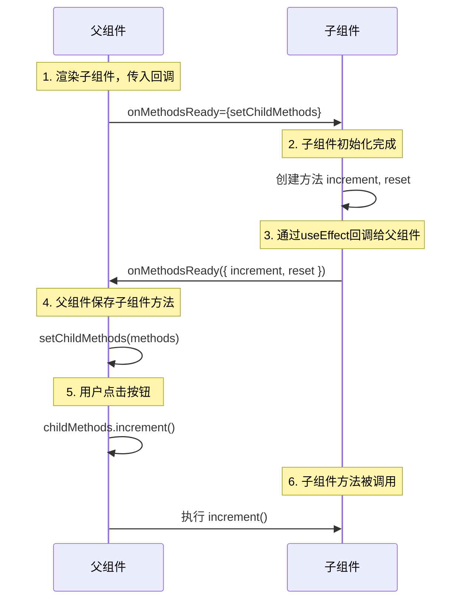
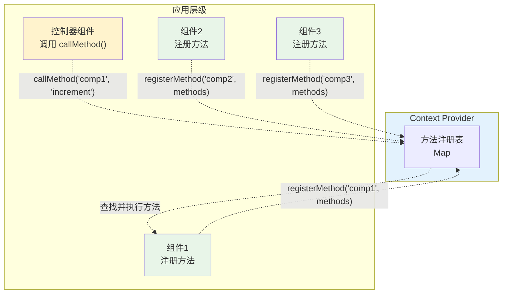
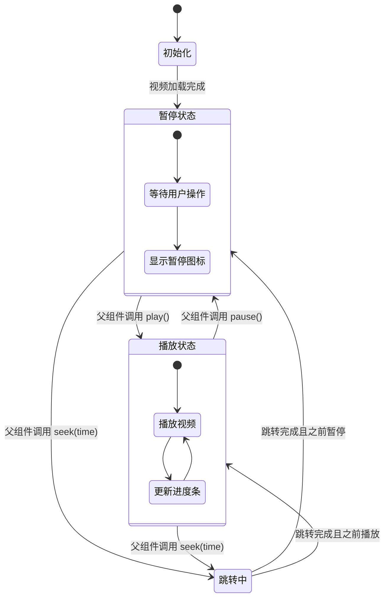
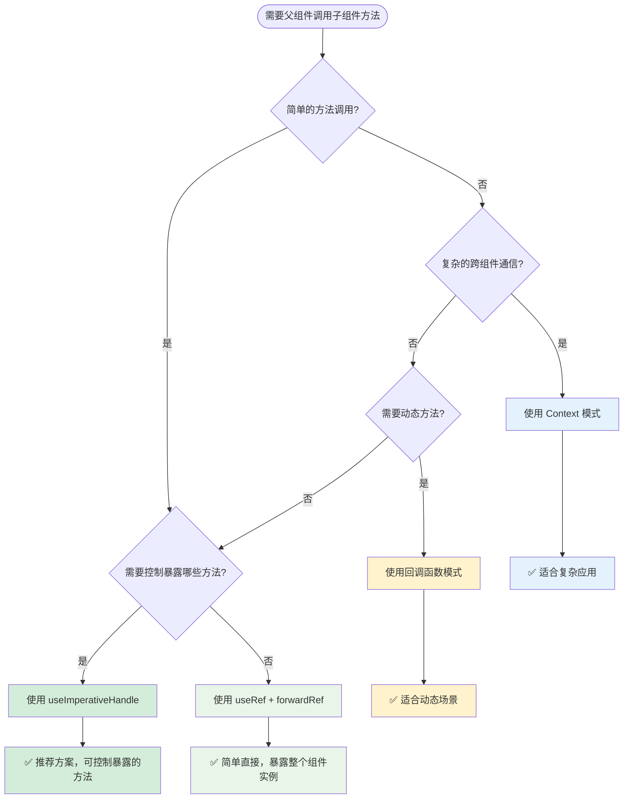

虽然 React 推荐单向数据流，但在某些特定情况下，父组件调用子组件方法是必要的，比如表单验证、媒体播放控制、焦点管理等。

本文介绍在 React 中实现父组件调用子组件方法的几种方式。

<!-- truncate -->

## 为什么需要父组件调用子组件方法？

在深入技术实现之前，让我们先了解一下什么情况下需要父组件调用子组件方法：

### 常见场景

1. **表单验证** - 父组件触发所有子表单组件的验证
2. **媒体控制** - 父组件控制视频/音频播放器的播放、暂停
3. **焦点管理** - 父组件控制输入框获取焦点
4. **动画控制** - 父组件触发子组件的动画效果
5. **数据刷新** - 父组件触发子组件重新获取数据

```jsx
// 典型场景示例
function ParentForm() {
  const handleSubmit = () => {
    // 需要调用所有子组件的验证方法
    // validateForm1()
    // validateForm2()
    // validateForm3()
  };

  return (
    <form onSubmit={handleSubmit}>
      <FormSection1 />
      <FormSection2 />
      <FormSection3 />
      <button type="submit">提交</button>
    </form>
  );
}
```

## 方法一：使用 useRef + forwardRef

这是最常用也是最推荐的方式，通过 ref 直接获取子组件实例的引用。

### 基础实现

```jsx
import React, {
  useRef,
  forwardRef,
  useImperativeHandle,
  useState,
} from "react";

// 子组件：使用forwardRef包装
const ChildComponent = forwardRef((props, ref) => {
  const [count, setCount] = useState(0);

  // 暴露给父组件的方法
  useImperativeHandle(ref, () => ({
    increment: () => setCount((prev) => prev + 1),
    reset: () => setCount(0),
    getValue: () => count,
  }));

  return <div>计数器: {count}</div>;
});

// 父组件
function ParentComponent() {
  const childRef = useRef();

  return (
    <div>
      <button onClick={() => childRef.current?.increment()}>+1</button>
      <button onClick={() => childRef.current?.reset()}>重置</button>
      <ChildComponent ref={childRef} />
    </div>
  );
}
```

### 执行流程图



## 方法二：useImperativeHandle 精确控制

`useImperativeHandle` 是 React 提供的一个 Hook，它可以让我们精确控制通过 ref 暴露给父组件的实例值。这是一个更安全和可控的方式。

### useImperativeHandle 基本语法

```jsx
useImperativeHandle(ref, createHandle, [deps]);
```

- **ref**: 需要被赋值的 ref 对象
- **createHandle**: 返回暴露给父组件的对象的函数
- **deps**: 依赖数组（可选），当依赖改变时重新创建 handle

### 核心特点

1. **精确控制** - 只暴露你想暴露的方法和属性
2. **封装性好** - 隐藏组件内部实现细节
3. **类型安全** - 配合 TypeScript 可以提供完整的类型检查

### 表单验证示例

```jsx
import React, {
  useRef,
  forwardRef,
  useImperativeHandle,
  useState,
} from "react";

// 表单组件
const FormComponent = forwardRef((props, ref) => {
  const [name, setName] = useState("");
  const [email, setEmail] = useState("");
  const [errors, setErrors] = useState({});

  // 验证方法 - 内部实现
  const validateForm = () => {
    const newErrors = {};
    if (!name.trim()) newErrors.name = "姓名不能为空";
    if (!email.includes("@")) newErrors.email = "邮箱格式不正确";

    setErrors(newErrors);
    return Object.keys(newErrors).length === 0;
  };

  // 重置方法 - 内部实现
  const resetForm = () => {
    setName("");
    setEmail("");
    setErrors({});
  };

  // 获取数据方法 - 内部实现
  const getFormData = () => {
    return { name, email };
  };

  // 🔑 关键：使用 useImperativeHandle 暴露方法
  useImperativeHandle(ref, () => ({
    // 只暴露需要的方法，隐藏内部实现
    validate: validateForm,
    reset: resetForm,
    getData: getFormData,
    // 可以暴露计算属性
    isValid: Object.keys(errors).length === 0,
    // 可以暴露只读数据
    fieldCount: 2,
  }));

  return (
    <div>
      <input
        value={name}
        onChange={(e) => setName(e.target.value)}
        placeholder="姓名"
      />
      {errors.name && <span style={{ color: "red" }}>{errors.name}</span>}

      <input
        value={email}
        onChange={(e) => setEmail(e.target.value)}
        placeholder="邮箱"
      />
      {errors.email && <span style={{ color: "red" }}>{errors.email}</span>}
    </div>
  );
});

// 父组件
function FormParent() {
  const formRef = useRef();

  const handleSubmit = () => {
    // 调用子组件的验证方法
    if (formRef.current?.validate()) {
      // 调用子组件的获取数据方法
      const data = formRef.current.getData();
      console.log("提交数据:", data);
      console.log("表单状态:", formRef.current.isValid);
    }
  };

  const handleReset = () => {
    // 调用子组件的重置方法
    formRef.current?.reset();
  };

  return (
    <div>
      <FormComponent ref={formRef} />
      <button onClick={handleSubmit}>提交</button>
      <button onClick={handleReset}>重置</button>
    </div>
  );
}
```

### useImperativeHandle 的优势

#### 1. **安全封装**

```jsx
// ❌ 直接暴露 ref，父组件可以访问所有内容
const UnsafeComponent = forwardRef((props, ref) => {
  const inputRef = useRef();

  // 父组件可以直接操作 DOM：ref.current.focus()
  return <input ref={ref} />;
});

// ✅ 使用 useImperativeHandle，只暴露需要的方法
const SafeComponent = forwardRef((props, ref) => {
  const inputRef = useRef();

  useImperativeHandle(ref, () => ({
    // 只暴露 focus 方法，隐藏其他 DOM 操作
    focus: () => inputRef.current.focus(),
    clear: () => {
      inputRef.current.value = "";
    },
  }));

  return <input ref={inputRef} />;
});
```

#### 2. **方法组合**

```jsx
const ComplexComponent = forwardRef((props, ref) => {
  const [data, setData] = useState([]);
  const [loading, setLoading] = useState(false);

  const fetchData = async () => {
    setLoading(true);
    // 获取数据逻辑
    setLoading(false);
  };

  const clearData = () => {
    setData([]);
  };

  useImperativeHandle(ref, () => ({
    // 组合多个操作
    refresh: async () => {
      clearData();
      await fetchData();
    },
    // 暴露状态和方法
    getData: () => data,
    isLoading: () => loading,
    // 暴露单独的操作
    clear: clearData,
  }));

  // ...组件渲染
});
```

#### 3. **条件暴露**

```jsx
const ConditionalComponent = forwardRef(({ allowReset = false }, ref) => {
  const [value, setValue] = useState("");

  useImperativeHandle(
    ref,
    () => {
      const methods = {
        getValue: () => value,
        setValue: (newValue) => setValue(newValue),
      };

      // 根据 props 条件暴露方法
      if (allowReset) {
        methods.reset = () => setValue("");
      }

      return methods;
    },
    [value, allowReset]
  ); // 依赖数组很重要

  // ...组件渲染
});
```

## 方法三：回调函数模式

另一种实现方式是通过回调函数，子组件将方法通过 props 回调给父组件。

### 回调模式时序图



```jsx
import React, { useState, useCallback, useEffect } from "react";

// 子组件通过回调暴露方法
function CallbackChild({ onMethodsReady }) {
  const [count, setCount] = useState(0);

  const increment = () => setCount((prev) => prev + 1);
  const reset = () => setCount(0);

  // 将方法通过回调传递给父组件
  useEffect(() => {
    onMethodsReady?.({ increment, reset });
  }, [onMethodsReady]);

  return <div>计数器: {count}</div>;
}

// 父组件
function CallbackParent() {
  const [childMethods, setChildMethods] = useState(null);

  return (
    <div>
      <button onClick={() => childMethods?.increment()}>+1</button>
      <button onClick={() => childMethods?.reset()}>重置</button>
      <CallbackChild onMethodsReady={setChildMethods} />
    </div>
  );
}
```

## 方法四：Context 模式

对于复杂的组件树，可以使用 Context 来实现跨层级的方法调用。

### Context 模式架构图



```jsx
import React, { createContext, useContext, useRef, useEffect } from "react";

// 创建Context
const ControlContext = createContext();

// Provider组件
function ControlProvider({ children }) {
  const methodsRef = useRef(new Map());

  const registerMethod = (id, methods) => {
    methodsRef.current.set(id, methods);
  };

  const callMethod = (id, methodName, ...args) => {
    const methods = methodsRef.current.get(id);
    return methods?.[methodName]?.(...args);
  };

  return (
    <ControlContext.Provider value={{ registerMethod, callMethod }}>
      {children}
    </ControlContext.Provider>
  );
}

// 子组件
function ControllableComponent({ id }) {
  const [count, setCount] = useState(0);
  const { registerMethod } = useContext(ControlContext);

  useEffect(() => {
    registerMethod(id, {
      increment: () => setCount((prev) => prev + 1),
      reset: () => setCount(0),
    });
  }, [id, registerMethod]);

  return (
    <div>
      {id}: {count}
    </div>
  );
}

// 控制器组件
function Controller() {
  const { callMethod } = useContext(ControlContext);

  return (
    <div>
      <button onClick={() => callMethod("comp1", "increment")}>组件1 +1</button>
      <button onClick={() => callMethod("comp1", "reset")}>组件1 重置</button>
    </div>
  );
}

// 主应用
function App() {
  return (
    <ControlProvider>
      <Controller />
      <ControllableComponent id="comp1" />
    </ControlProvider>
  );
}
```

## 实际应用案例：视频播放器控制

### 视频播放器控制流程



```jsx
import React, {
  useRef,
  forwardRef,
  useImperativeHandle,
  useState,
} from "react";

// 视频播放器组件
const VideoPlayer = forwardRef(({ src }, ref) => {
  const videoRef = useRef();
  const [isPlaying, setIsPlaying] = useState(false);

  useImperativeHandle(ref, () => ({
    play: () => {
      videoRef.current.play();
      setIsPlaying(true);
    },
    pause: () => {
      videoRef.current.pause();
      setIsPlaying(false);
    },
    seek: (time) => {
      videoRef.current.currentTime = time;
    },
  }));

  return (
    <div>
      <video
        ref={videoRef}
        src={src}
        style={{ width: "100%", maxWidth: "400px" }}
      />
      <p>状态: {isPlaying ? "播放中" : "暂停"}</p>
    </div>
  );
});

// 播放器控制台
function VideoController() {
  const playerRef = useRef();

  return (
    <div>
      <div>
        <button onClick={() => playerRef.current?.play()}>播放</button>
        <button onClick={() => playerRef.current?.pause()}>暂停</button>
        <button onClick={() => playerRef.current?.seek(10)}>跳转到10秒</button>
      </div>

      <VideoPlayer ref={playerRef} src="your-video-url.mp4" />
    </div>
  );
}
```

### useImperativeHandle 的注意事项

#### 1. **使用依赖数组**

```jsx
const MyComponent = forwardRef((props, ref) => {
  const [count, setCount] = useState(0);

  const increment = useCallback(() => {
    setCount((prev) => prev + 1);
  }, []);

  // ✅ 正确：提供依赖数组
  useImperativeHandle(
    ref,
    () => ({
      increment,
      getCount: () => count,
    }),
    [increment, count]
  );
});
```

#### 2. **避免过度使用**

```jsx
// ❌ 不好：暴露太多内部状态
useImperativeHandle(ref, () => ({
  setState,
  setError,
  setLoading,
  internalData,
  privateMethod,
}));

// ✅ 好：只暴露必要的接口
useImperativeHandle(ref, () => ({
  submit,
  reset,
  validate,
}));
```

#### 3. **配合 forwardRef 使用**

```jsx
// ✅ useImperativeHandle 必须在 forwardRef 组件中使用
const MyComponent = forwardRef((props, ref) => {
  useImperativeHandle(ref, () => ({
    // 暴露的方法
  }));
});
```

## 小结

### 1. 选择合适的方法



### 2. 各方法特点对比

| 方法                    | 优势                                                             | 劣势                                 | 适用场景                                     | 推荐度     |
| ----------------------- | ---------------------------------------------------------------- | ------------------------------------ | -------------------------------------------- | ---------- |
| **useImperativeHandle** | • 可精确控制暴露的方法<br />• 更好的封装性<br />• 易于维护和测试 | • 需要额外的配置<br />• 稍微复杂一些 | • 所有需要父调子的场景<br />• 特别是复杂组件 | ⭐⭐⭐⭐⭐ |
| useRef + forwardRef     | • 简单直接<br />• 完全访问子组件                                 | • 暴露整个组件实例<br />• 破坏封装性 | • 简单组件<br />• 快速原型开发               | ⭐⭐⭐     |
| 回调函数                | • 灵活性高<br />• 支持动态方法                                   | • 性能开销<br />• 代码复杂           | • 动态交互场景<br />• 条件性方法调用         | ⭐⭐⭐     |
| Context                 | • 支持深层嵌套<br />• 全局状态管理                               | • 过度设计风险<br />• 性能影响       | • 复杂应用架构<br />• 多层级组件通信         | ⭐⭐       |
