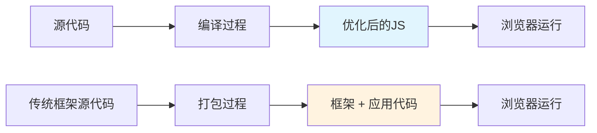
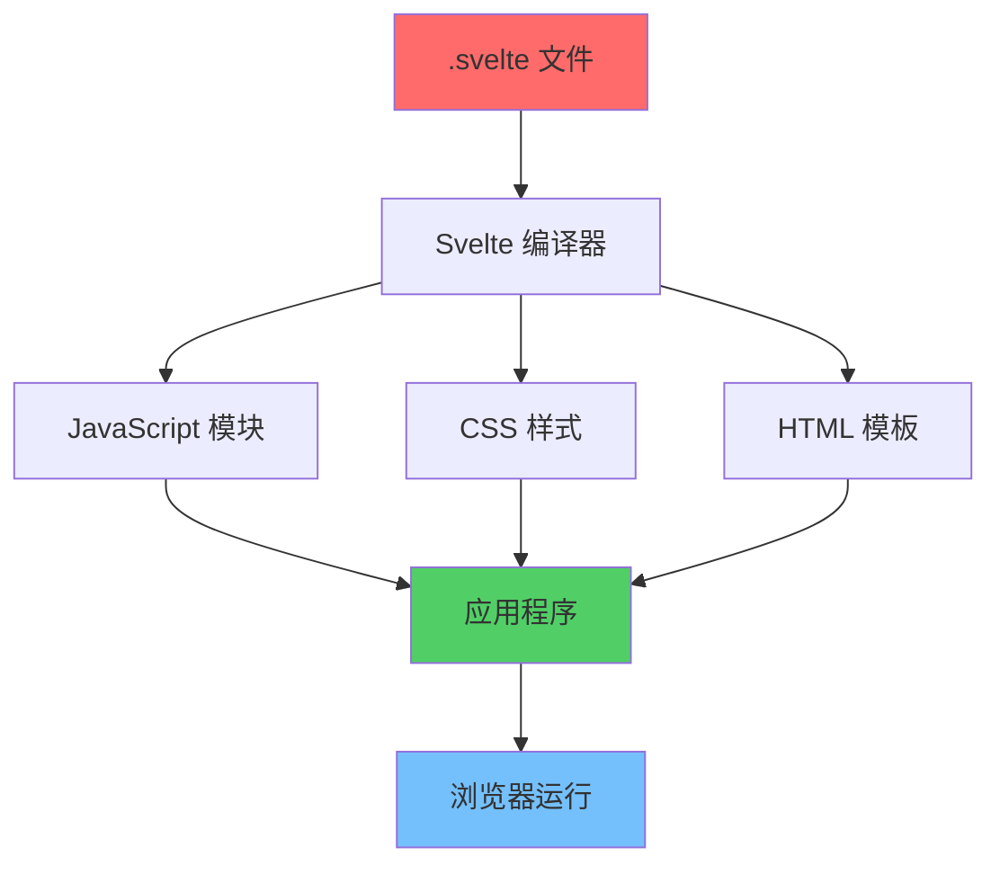
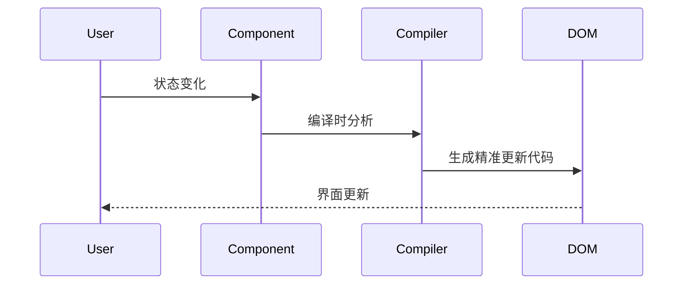

Svelte 是一个相对较新但备受关注的前端框架，它采用了与 React、Vue 等传统框架不同的编译时优化方式。

<!-- truncate -->

## 什么是 Svelte？

Svelte 是一个现代化的前端框架，由 Rich Harris 于 2016 年创建。与传统的运行时框架不同，Svelte 是一个**编译时框架**，它在构建过程中将组件编译成高效的原生 JavaScript 代码。

### 核心特性

- **编译时优化**：无需运行时库，生成的代码更小更快
- **反应式更新**：基于编译时分析的精准更新
- **简洁的语法**：更少的样板代码，更直观的开发体验
- **零配置**：开箱即用的开发环境

## Svelte vs 传统框架

### 传统框架的工作方式

传统框架如 React、Vue 等需要在浏览器中运行虚拟 DOM 算法来管理状态变化和 DOM 更新。这意味着：

- 需要引入框架运行时代码
- 在运行时进行状态对比和 DOM 操作
- 包体积较大，运行时开销较高

### Svelte 的工作方式

Svelte 在编译时就确定了状态变化如何影响 DOM，生成的代码：

- 没有运行时框架代码
- 直接操作 DOM，无需虚拟 DOM
- 包体积小，运行时性能优异

## Svelte 的架构设计

## 主要优势

### 1. 性能优异

- **更小的包体积**：编译后的代码不包含框架运行时
- **更快的运行速度**：直接 DOM 操作，无虚拟 DOM 开销
- **更少的内存占用**：没有额外的抽象层

### 2. 开发体验

- **简洁的语法**：更少的样板代码
- **内置功能**：状态管理、动画、过渡效果开箱即用
- **优秀的开发工具**：热重载、源码映射等

### 3. 学习曲线

- **易于上手**：接近原生 HTML/CSS/JS 的语法
- **概念简单**：无需理解复杂的虚拟 DOM 概念
- **渐进式**：可以逐步引入到现有项目

## 反应式系统

Svelte 的反应式系统是其核心特性之一。它通过编译时分析来实现精准的响应式更新：

### 官方资源

- [Svelte 官方网站](https://svelte.dev/) - 官方文档和教程
- [SvelteKit 官方文档](https://kit.svelte.dev/) - 全栈应用框架
- [Svelte 官方教程](https://svelte.dev/tutorial) - 互动式学习教程
- [Svelte 官方示例](https://svelte.dev/examples) - 官方代码示例

### 开发工具

- [Svelte for VS Code](https://marketplace.visualstudio.com/items?itemName=svelte.svelte-vscode) - 官方 VS Code 扩展
- [Svelte DevTools](https://chrome.google.com/webstore/detail/svelte-devtools/ckolcbmkjpjcekcfhkrdmfaakgkikedk) - Chrome 开发者工具
- [Vite Svelte 模板](https://github.com/sveltejs/template) - 官方项目模板

### 学习资源

- [Svelte 中文文档](https://svelte.nodejs.cn/) - 非官方中文翻译
- [Svelte Society](https://sveltesociety.dev/) - 社区资源和工具
- [Svelte GitHub 仓库](https://github.com/sveltejs/svelte) - 源代码和问题跟踪
