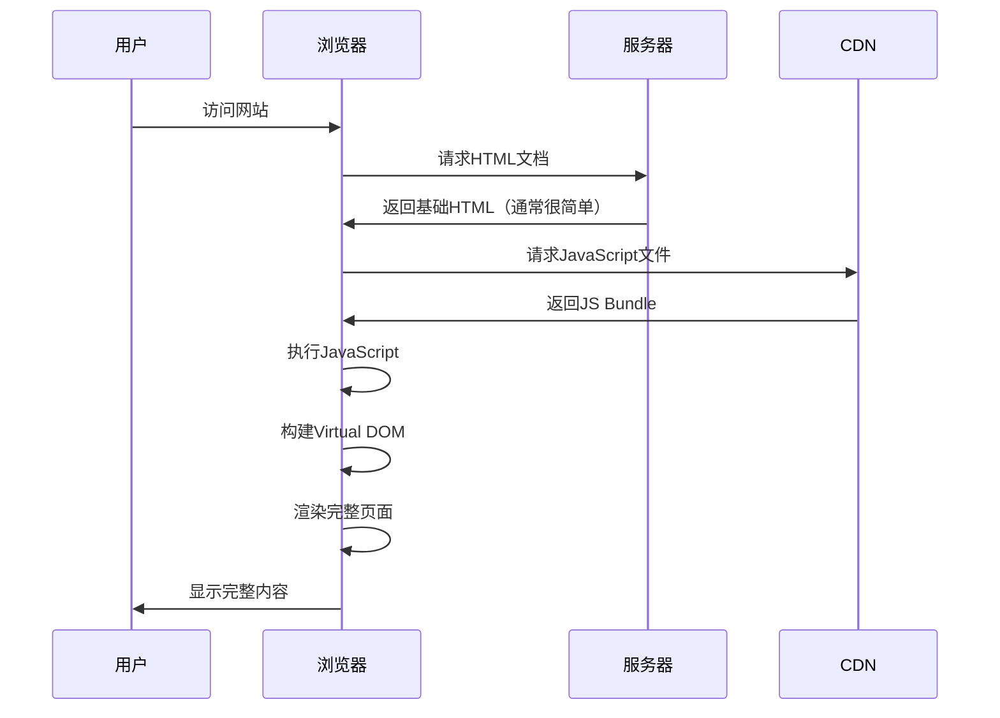
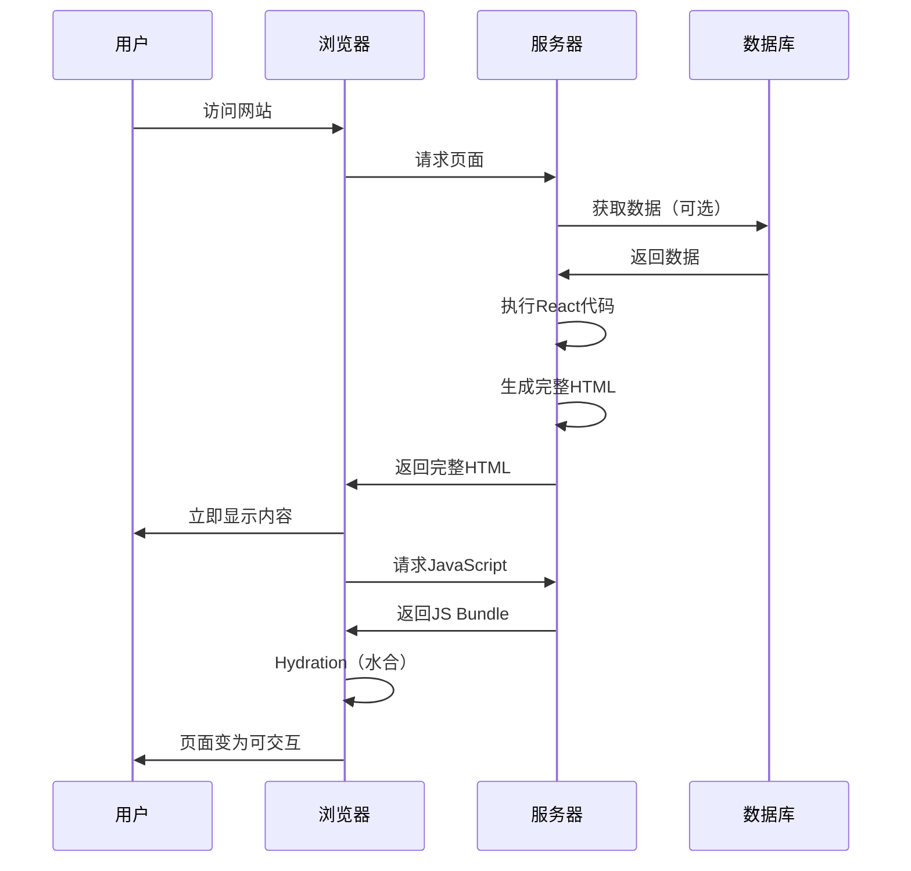
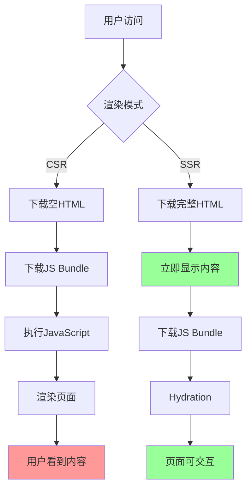
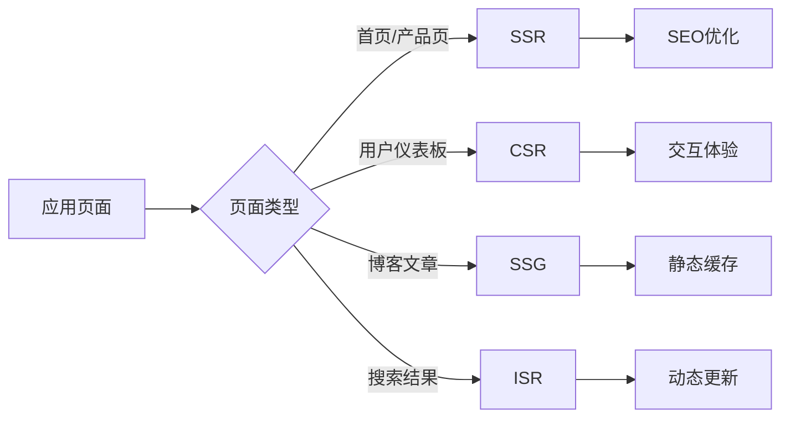
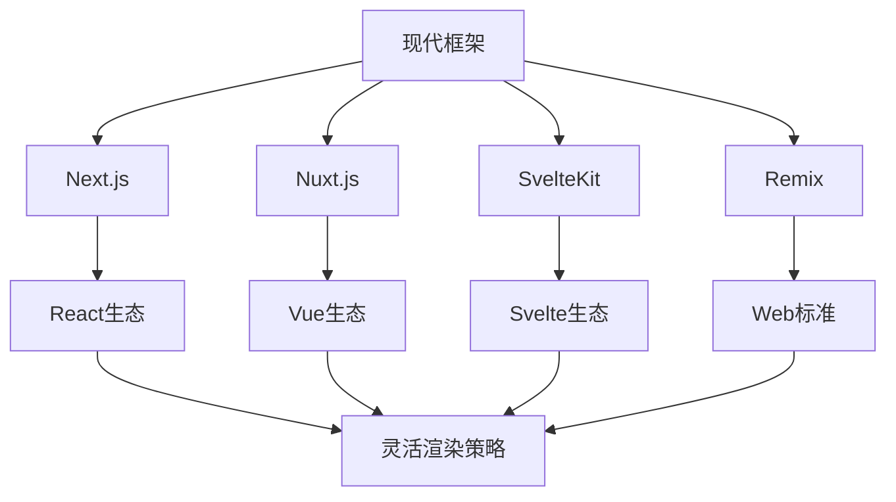

# React 客户端渲染 vs 服务端渲染

在现代前端开发中，渲染策略的选择对应用的性能、SEO 和用户体验都有着重要影响。React 作为主流前端框架，支持多种渲染模式，其中客户端渲染（CSR）和服务端渲染（SSR）是最常见的两种。

<!-- truncate -->

## 什么是客户端渲染（CSR）？

客户端渲染（Client-Side Rendering，CSR）是指 JavaScript 代码在浏览器中执行，动态生成 HTML 内容的渲染方式。这是 React 应用的默认渲染模式。

### CSR 的工作流程



### CSR 的特点

1. **初始 HTML 简单**：服务器返回的 HTML 通常只包含一个 root div
2. **JavaScript 驱动**：页面内容完全由 JavaScript 生成
3. **客户端路由**：页面跳转不需要服务器参与

### CSR 示例代码

```jsx
// 典型的CSR应用入口
import ReactDOM from "react-dom/client";
import App from "./App";

const root = ReactDOM.createRoot(document.getElementById("root"));
root.render(<App />);
```

服务器返回的 HTML 可能是这样的：

```html
<!DOCTYPE html>
<html>
  <head>
    <title>My React App</title>
  </head>
  <body>
    <div id="root"></div>
    <script src="/static/js/bundle.js"></script>
  </body>
</html>
```

## 什么是服务端渲染（SSR）？

服务端渲染（Server-Side Rendering，SSR）是指在服务器上执行 React 代码，生成完整的 HTML 内容，然后发送给浏览器的渲染方式。

### SSR 的工作流程



### SSR 的特点

1. **完整 HTML**：服务器返回包含所有内容的 HTML
2. **首屏快速显示**：用户可以立即看到内容
3. **SEO 友好**：搜索引擎可以直接索引内容
4. **Hydration 过程**：客户端 JavaScript 接管服务器渲染的 DOM

### SSR 示例代码

```jsx
// 服务器端代码（Node.js + Express）
import express from "express";
import { renderToString } from "react-dom/server";
import App from "./App";

const app = express();

app.get("*", (req, res) => {
  const html = renderToString(<App />);

  res.send(`
    <!DOCTYPE html>
    <html>
      <head>
        <title>My SSR App</title>
      </head>
      <body>
        <div id="root">${html}</div>
        <script src="/static/js/bundle.js"></script>
      </body>
    </html>
  `);
});
```

```jsx
// 客户端Hydration代码
import { hydrateRoot } from "react-dom/client";
import App from "./App";

// 使用hydrateRoot而不是createRoot
hydrateRoot(document.getElementById("root"), <App />);
```

## CSR vs SSR 对比分析

### 性能对比



### 详细对比表

| 方面             | CSR                     | SSR                          |
| ---------------- | ----------------------- | ---------------------------- |
| **首屏加载时间** | 较慢，需要下载并执行 JS | 较快，立即显示内容           |
| **SEO**          | 较差，需要额外配置      | 优秀，天然支持               |
| **服务器负载**   | 低，只需要静态文件服务  | 高，需要执行 React 代码      |
| **缓存策略**     | 简单，可以 CDN 缓存     | 复杂，需要动态缓存           |
| **用户体验**     | 初始加载慢，后续操作快  | 初始显示快，需要等待可交互   |
| **开发复杂度**   | 简单                    | 复杂，需要考虑服务器和客户端 |

## 各自的优缺点

| 渲染方式           | 优点                                                                                                                                   | 缺点                                                                                      |
| ------------------ | -------------------------------------------------------------------------------------------------------------------------------------- | ----------------------------------------------------------------------------------------- |
| **CSR 客户端渲染** | 🚀 部署简单，只需要静态文件服务器<br/>💰 服务器成本低<br/>🔄 页面切换流畅，SPA 体验好<br/>🛠️ 开发调试方便<br/>📦 可以充分利用 CDN 缓存 | 🐌 首屏加载时间长<br/>🔍 SEO 不友好<br/>📱 在低端设备上性能较差<br/>🌐 对网络环境要求较高 |
| **SSR 服务端渲染** | ⚡ 首屏加载快<br/>🔍 SEO 友好<br/>📱 对低端设备友好<br/>🌐 对网络环境要求低                                                            | 💰 服务器成本高<br/>🔄 页面切换可能有闪烁<br/>🛠️ 开发复杂度高<br/>📦 缓存策略复杂         |

## 混合渲染策略

现代应用往往不会完全采用单一的渲染策略，而是根据不同页面的特点选择合适的渲染方式：



### 静态站点生成（SSG）

SSG 在构建时预渲染页面，结合了 SSR 的 SEO 优势和 CSR 的缓存优势：

```jsx
// Next.js SSG 示例
export async function getStaticProps() {
  const data = await fetchData();

  return {
    props: { data },
    // 增量静态再生成
    revalidate: 60,
  };
}

export default function Page({ data }) {
  return <div>{data.content}</div>;
}
```

### 增量静态再生成（ISR）

ISR 允许在运行时更新静态页面，平衡了性能和内容新鲜度：

```jsx
// 在请求时重新验证
export async function getStaticProps() {
  return {
    props: { data: await fetchData() },
    revalidate: 10, // 每10秒重新验证一次
  };
}
```

### 现代解决方案

推荐使用现代全栈框架，它们提供了灵活的渲染选择：


