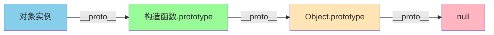
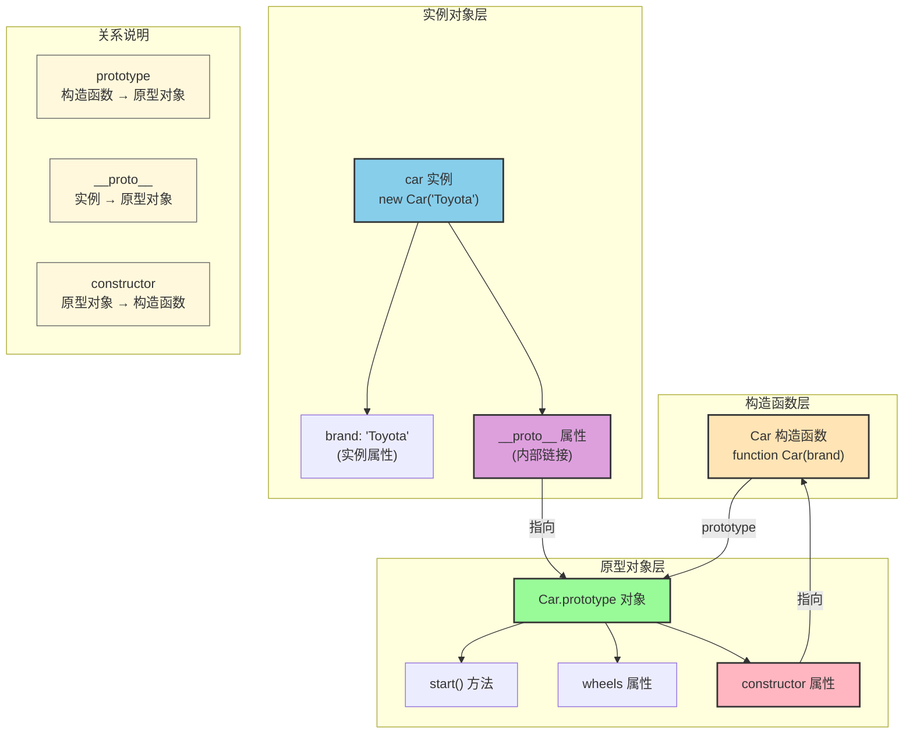
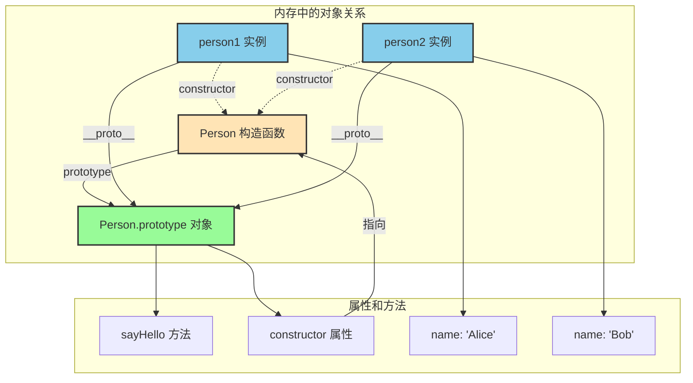
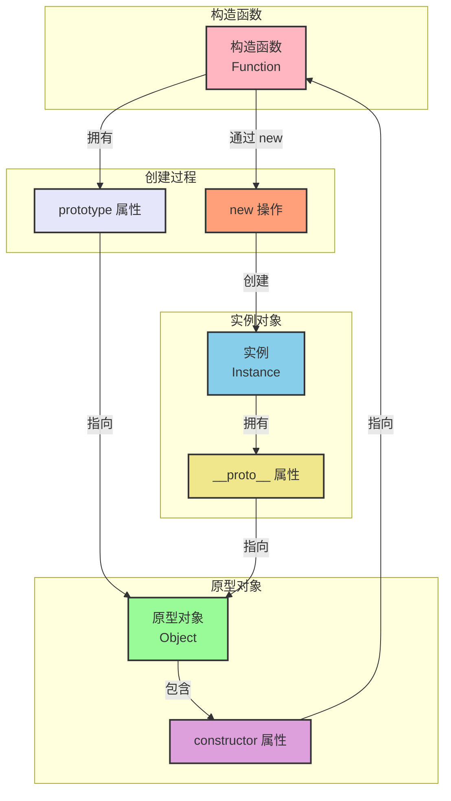
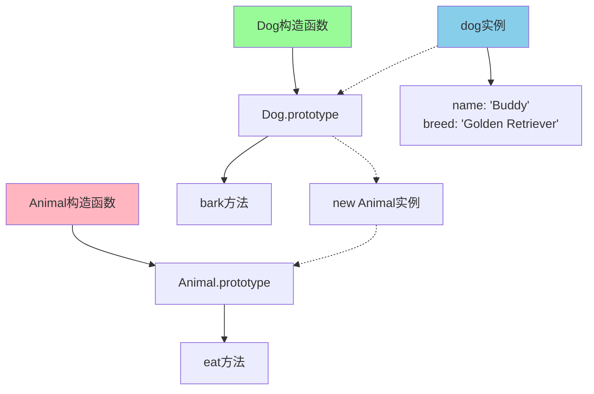
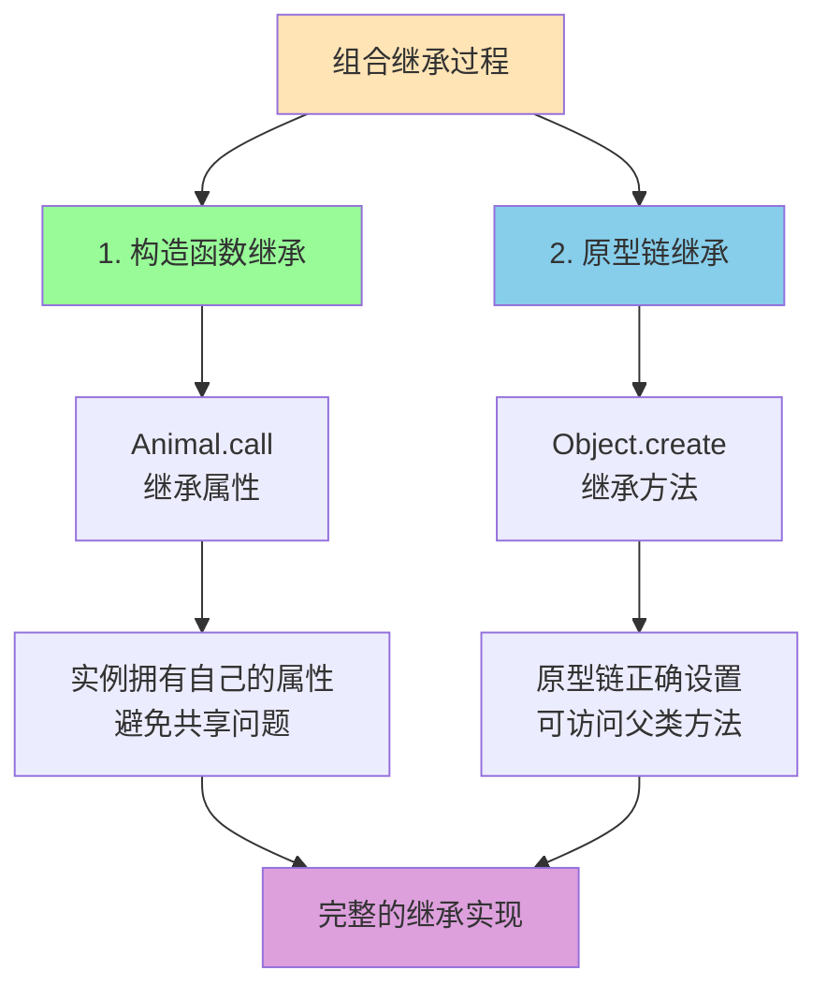
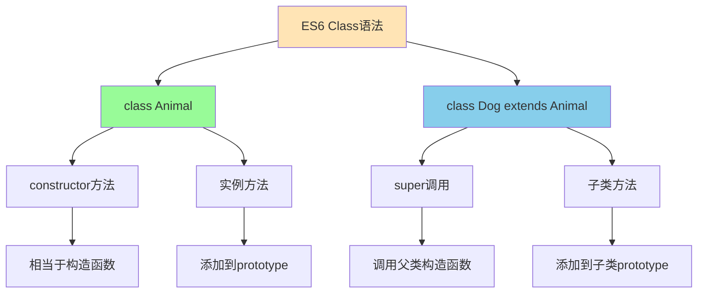
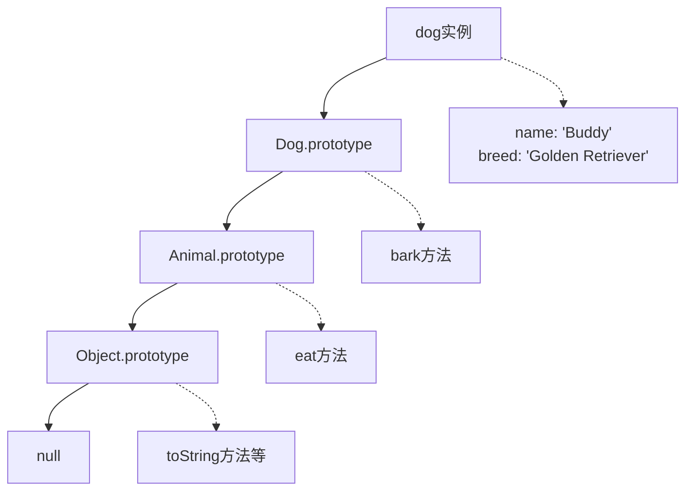

理解 JavaScript 的原型与继承很重要。本文将通过简洁的代码示例和直观的图表，帮助你深入理解 JavaScript 的原型链和继承模式。

<!-- truncate -->

## 原型链基础

JavaScript 是基于原型的语言，这与传统的基于类的语言（如 Java、C++）不同。在 JavaScript 中，每个对象都有一个内部链接指向另一个对象，这个对象就是原型（prototype）。

当我们访问一个对象的属性或方法时，JavaScript 引擎会先在对象本身查找，如果找不到，就会沿着原型链向上查找，直到找到为止或者到达原型链的顶端（null）。这种查找机制就是原型链的工作原理。



```javascript
// 构造函数
function Person(name) {
  this.name = name;
}

// 在原型上添加方法
Person.prototype.sayHello = function () {
  return `Hello, I'm ${this.name}`;
};

const person = new Person("Alice");
console.log(person.sayHello()); // "Hello, I'm Alice"

// 原型链查找
console.log(person.__proto__ === Person.prototype); // true
console.log(Person.prototype.__proto__ === Object.prototype); // true
```

在上面的例子中，当我们调用 `person.sayHello()` 时，JavaScript 引擎首先在 `person` 对象本身查找 `sayHello` 方法，没找到后就会在 `Person.prototype` 中查找并找到了这个方法。

需要注意的是，`__proto__` 是一个非标准属性（虽然被广泛支持），在实际开发中应该使用 `Object.getPrototypeOf()` 来获取对象的原型。

## 深入理解原型（Prototype）

在深入学习继承之前，我们需要更详细地理解原型的概念和工作机制。

### 什么是原型？

在 JavaScript 中，原型（prototype）是一个对象，它包含了可以被其他对象共享的属性和方法。每个函数都有一个 `prototype` 属性，指向一个对象，这个对象就是通过该构造函数创建的实例的原型。

```javascript
function Person(name) {
  this.name = name;
}

// Person.prototype 是一个对象
console.log(typeof Person.prototype); // "object"
console.log(Person.prototype); // { constructor: Person }

// 为原型添加方法
Person.prototype.sayHello = function () {
  return `Hello, I'm ${this.name}`;
};

Person.prototype.age = 0; // 添加属性

const person1 = new Person("Alice");
const person2 = new Person("Bob");

// 两个实例共享相同的原型
console.log(person1.__proto__ === person2.__proto__); // true
console.log(person1.__proto__ === Person.prototype); // true
```

### 原型的三个关键概念

理解 `prototype`、`__proto__` 和 `constructor` 之间的关系是掌握 JavaScript 原型链的关键。让我们通过图表和代码来深入理解：



#### 1. prototype 属性

- **只有函数才有** `prototype` 属性
- 指向一个对象，这个对象会成为通过该构造函数创建的实例的原型
- 可以在这个对象上添加共享的方法和属性

```javascript
function Car(brand) {
  this.brand = brand;
}

// 在原型上添加方法
Car.prototype.start = function () {
  return `${this.brand} is starting`;
};

Car.prototype.wheels = 4; // 添加属性

console.log(Car.prototype); // { start: function, wheels: 4, constructor: Car }
console.log(typeof Car.prototype); // "object"
```

#### 2. **proto** 属性（内部原型）

- **每个对象都有** `__proto__` 属性（非标准，但广泛支持）
- 指向创建该对象的构造函数的 `prototype`
- 是原型链查找的实际路径

```javascript
const car = new Car("Toyota");
console.log(car.__proto__ === Car.prototype); // true

// 标准方式获取原型
console.log(Object.getPrototypeOf(car) === Car.prototype); // true

// 普通对象也有 __proto__
const obj = {};
console.log(obj.__proto__ === Object.prototype); // true
```

#### 3. constructor 属性

- **每个原型对象都有** `constructor` 属性
- 指向创建该原型的构造函数
- 用于标识对象的构造函数

```javascript
console.log(Car.prototype.constructor === Car); // true
console.log(car.constructor === Car); // true

// 通过constructor创建同类型对象
const anotherCar = new car.constructor("Honda");
console.log(anotherCar instanceof Car); // true
```

### 三者关系的完整图解

为了更清楚地理解这三个概念的关系，让我们看一个完整的示例：



```javascript
function Person(name) {
  this.name = name;
}

Person.prototype.sayHello = function () {
  return `Hello, I'm ${this.name}`;
};

const person1 = new Person("Alice");
const person2 = new Person("Bob");

// 验证关系
console.log("=== prototype 关系 ===");
console.log(Person.prototype); // { sayHello: function, constructor: Person }
console.log(typeof Person.prototype); // "object"

console.log("=== __proto__ 关系 ===");
console.log(person1.__proto__ === Person.prototype); // true
console.log(person2.__proto__ === Person.prototype); // true
console.log(person1.__proto__ === person2.__proto__); // true

console.log("=== constructor 关系 ===");
console.log(Person.prototype.constructor === Person); // true
console.log(person1.constructor === Person); // true
console.log(person2.constructor === Person); // true
```

### 关系总结

让我们用一个更直观的方式来总结三者的关系：



#### 核心关系：

1. **构造函数.prototype** → **原型对象**
2. **原型对象.constructor** → **构造函数**
3. **实例.**proto\***\* → **原型对象\*\*

#### 记忆口诀：

- **prototype**：函数的"设计图纸"
- \***\*proto\*\***：实例的"查找路径"
- **constructor**：原型的"身份证明"

### 常见误区澄清

#### 误区 1：混淆 prototype 和 **proto**

```javascript
function Person() {}
const person = new Person();

// 正确理解
console.log(Person.prototype); // 构造函数的原型对象
console.log(person.__proto__); // 实例的内部原型
console.log(Person.prototype === person.__proto__); // true

// 错误理解
console.log(Person.__proto__); // 这是 Person 作为函数对象的原型
```

#### 误区 2：认为 constructor 是实例的属性

```javascript
function Person(name) {
  this.name = name;
}

const person = new Person("Alice");

// constructor 实际上在原型上
console.log(person.hasOwnProperty("constructor")); // false
console.log(Person.prototype.hasOwnProperty("constructor")); // true

// 实例通过原型链访问到 constructor
console.log(person.constructor === Person); // true
```

#### 误区 3：修改 constructor 会影响继承

```javascript
function Parent() {}
function Child() {}

Child.prototype = Object.create(Parent.prototype);
// 忘记设置 constructor
console.log(Child.prototype.constructor === Parent); // true (错误)

// 正确设置
Child.prototype.constructor = Child;
console.log(Child.prototype.constructor === Child); // true
```

通过这些详细的讲解，我们可以看到原型是 JavaScript 面向对象编程的核心机制，理解原型对于掌握 JavaScript 的继承和对象模型至关重要。

## 继承的实现方式

在 JavaScript 中，继承的实现有多种方式，每种方式都有其优缺点。让我们逐一了解这些方式。

### 原型链继承

原型链继承是最直接的继承方式，通过将子类的原型指向父类的实例来实现继承。



```javascript
// 父类
function Animal(name) {
  this.name = name;
  this.species = ["mammal"];
}

Animal.prototype.eat = function () {
  return `${this.name} is eating`;
};

// 子类
function Dog(name, breed) {
  this.name = name;
  this.breed = breed;
}

// 设置继承关系
Dog.prototype = new Animal();
Dog.prototype.constructor = Dog;

Dog.prototype.bark = function () {
  return `${this.name} is barking`;
};

const dog = new Dog("Buddy", "Golden Retriever");
console.log(dog.eat()); // "Buddy is eating"
console.log(dog.bark()); // "Buddy is barking"
```

**优点**：简单易理解，能够继承父类原型上的方法。
**缺点**：所有实例共享父类的引用类型属性，创建子类实例时无法向父类构造函数传参。

### 构造函数继承

构造函数继承通过在子类构造函数中调用父类构造函数来实现属性的继承。

```javascript
function Animal(name) {
  this.name = name;
  this.species = ["mammal"];
}

function Dog(name, breed) {
  Animal.call(this, name); // 调用父类构造函数
  this.breed = breed;
}

const dog = new Dog("Buddy", "Golden Retriever");
console.log(dog.name); // "Buddy"
// 但无法访问父类原型上的方法
```

**优点**：避免了引用类型属性被共享的问题，可以向父类构造函数传参。
**缺点**：无法继承父类原型上的方法，每个实例都会复制一份父类的方法，造成内存浪费。

### 组合继承（推荐）

组合继承结合了原型链继承和构造函数继承的优点，是最常用的继承方式。



```javascript
function Animal(name) {
  this.name = name;
  this.species = ["mammal"];
}

Animal.prototype.eat = function () {
  return `${this.name} is eating`;
};

function Dog(name, breed) {
  Animal.call(this, name); // 继承属性
  this.breed = breed;
}

Dog.prototype = Object.create(Animal.prototype); // 继承方法
Dog.prototype.constructor = Dog;

Dog.prototype.bark = function () {
  return `${this.name} is barking`;
};

const dog = new Dog("Buddy", "Golden Retriever");
console.log(dog.eat()); // "Buddy is eating"
console.log(dog.bark()); // "Buddy is barking"
```

这种方式通过 `Animal.call(this, name)` 继承父类的属性，通过 `Object.create(Animal.prototype)` 继承父类的方法。使用 `Object.create()` 而不是 `new Animal()` 可以避免调用父类构造函数，更加高效。

## ES6 Class 语法

ES6 引入的 class 语法让 JavaScript 的面向对象编程更加直观和易读。虽然语法上类似于传统的面向对象语言，但底层仍然是基于原型的继承机制。



```javascript
class Animal {
  constructor(name) {
    this.name = name;
  }

  eat() {
    return `${this.name} is eating`;
  }
}

class Dog extends Animal {
  constructor(name, breed) {
    super(name); // 调用父类构造函数
    this.breed = breed;
  }

  bark() {
    return `${this.name} is barking`;
  }
}

const dog = new Dog("Buddy", "Golden Retriever");
console.log(dog.eat()); // "Buddy is eating"
console.log(dog.bark()); // "Buddy is barking"
```

使用 class 语法的优势：

- **语法简洁**：更接近传统面向对象语言的写法
- **易于理解**：类和继承的概念更加直观
- **内置支持**：`extends` 和 `super` 关键字简化了继承的实现
- **严格模式**：类代码自动在严格模式下运行，避免一些常见错误

## 原型链继承关系图

下面的图表展示了在继承关系中，对象实例如何通过原型链访问到不同层级的属性和方法：



从图中可以看出：

1. `dog` 实例拥有自己的属性（name, breed）
2. `Dog.prototype` 包含子类特有的方法（bark）
3. `Animal.prototype` 包含父类的方法（eat）
4. `Object.prototype` 包含所有对象共有的方法（toString 等）

当调用 `dog.eat()` 时，JavaScript 引擎会按照这个原型链向上查找，直到在 `Animal.prototype` 中找到 `eat` 方法。

## 关键概念总结

理解 JavaScript 原型与继承需要掌握以下几个核心概念：

- **原型链**：对象通过`__proto__`（或`[[Prototype]]`）链接形成的查找链，这是 JavaScript 实现继承的基础机制
- **prototype**：函数的原型对象，包含共享的方法和属性，所有通过该构造函数创建的实例都会继承这些内容
- **constructor**：原型对象的构造函数引用，用于标识对象是由哪个构造函数创建的
- **继承方式**：组合继承（ES5）和 ES6 class 都是实用的选择，后者语法更现代但本质相同

掌握这些概念能让你更好地理解 JavaScript 的对象模型，写出更优雅的面向对象代码。无论是维护旧代码还是开发新项目，深入理解原型链都是必不可少的技能。

#### 关系说明

通过上面的图表，我们可以清楚地看到三者之间的关系：

**prototype（原型属性）**：

- 只有函数对象才拥有这个属性
- 指向一个对象，这个对象包含了共享的方法和属性
- 是所有实例的"模板"或"蓝图"

\***\*proto**（内部原型）\*\*：

- 每个对象都有这个内部属性
- 指向创建该对象的构造函数的 prototype
- 是原型链查找的实际路径

**constructor（构造函数引用）**：

- 存在于原型对象上的属性
- 指向创建该原型对象的构造函数
- 用于标识对象的"出身"
